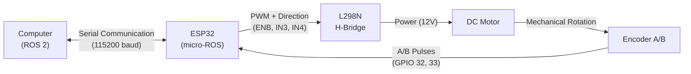

# Guide 0: Design of a micro-ROS Node for a DC Motor

<div align="center">

**Course:** Intelligent Control (`ING01343-ING278`)  
**Institution:** Politécnico Colombiano Jaime Isaza Cadavid — Faculty of Engineering  
**Instructor:** Deimer Miranda Montoya, MSc.(c) — `deimer_miranda91162@elpoli.edu.co`  
**Academic Period:** 2026-2  
**Estimated Time:** 3 to 4 hours (Guided and individual autonomous work)  
**Platform:** Pop!_OS / Ubuntu 22.04 LTS + ROS 2 Humble + ESP32 + micro-ROS

</div>

---

## 1. Introduction

In a control system, having a mathematical algorithm is not sufficient on its own. To actuate on a real physical plant, it is necessary to measure variables, process information, and translate controller decisions into physical control signals capable of driving the system.

In this lab, a micro-ROS node running on an ESP32 microcontroller will be designed and implemented to interface with a DC motor. The experimental setup consists of:

* A computer running **Pop!_OS / Ubuntu 22.04 LTS** with **ROS 2 Humble**.
* An **ESP32** running **micro-ROS**.
* An **L298N** H-Bridge power driver.
* A **DC Motor** with an integrated gearbox.
* An **incremental quadrature optical/magnetic encoder**.

The primary objective of this guide is not to start by writing code. First, we will understand the system, define the responsibilities of each hardware and software component, design the communication interfaces, and only then translate these engineering decisions into an implementation.

> [!TIP]
> **Core Design Principle:**
> Node design must begin by asking what it must do, what inputs it requires, what outputs it produces, and when each task must be executed.

---

### 1.1. Learning Objectives

By the end of this practical guide, the student will be able to:

1. Explain the physical and software architecture of a distributed **ROS 2 — micro-ROS** system.
2. Define the exact scope and responsibilities of a micro-ROS node on a microcontroller.
3. Design ROS 2 topics, message types, and engineering units before programming.
4. Differentiate between subscriber callbacks, hardware interrupts (ISRs), periodic timers, and executors.
5. Acquire quadrature signals from an incremental encoder.
6. Estimate angular velocity in $\text{rad/s}$ and in $\text{rpm}$.
7. Drive a DC motor using PWM and an L298N H-Bridge.
8. Integrate the ESP32 with ROS 2 through `micro_ros_agent`.
9. Experimentally visualize and log the dynamic response of the system.

---

### 1.2. Relationship with Intelligent Control

In a closed-loop speed control system, we compare the desired velocity with the actual measured velocity:

$$e(t) = \omega_{\text{ref}}(t) - \omega(t)$$

Subsequently, a feedback controller uses this error signal to compute a control action $u(t)$.

However, before implementing any control law, two fundamental engineering questions must be answered:

$$\textbf{How does the system measure motor speed, and how does it convert a numerical control action into physical motion?}$$

This practical guide builds this exact infrastructure. The resulting architecture will serve as the foundation for the experimental methodology:

$$\boxed{\text{Step Test} \longrightarrow \text{CSV Data} \longrightarrow \text{Parametric Identification} \longrightarrow \text{Mathematical Model} \longrightarrow \text{Closed-Loop Control}}$$

---

## 2. Fundamental Concepts of ROS 2 and micro-ROS

ROS 2 allows building distributed robotic systems using modular software components that exchange information asynchronously.

### Key Concepts:

* **Node:** Logical execution unit dedicated to a specific, well-defined responsibility.
* **Topic:** Logical communication channel through which messages flow under the publisher/subscriber pattern.
* **Message:** Strongly typed data structure defining the payload format.
* **Publisher & Subscriber:** Mechanisms used to send and receive messages on a topic, respectively.

> [!NOTE]
> A node is a software process, not a physical hardware device. A single computer can run multiple nodes concurrently, and the ESP32 runs a specialized micro-ROS node.


**Graphical Conventions:**
* **Ellipses (`([ ... ])`):** ROS 2 or micro-ROS nodes.
* **Rounded Rectangles (`[ ... ]`):** Topics.
* **Rectangular Blocks:** Physical hardware components.

---

### 2.1. What does micro-ROS provide?

Standard ROS 2 runs on full-fledged POSIX operating systems (Linux/Windows). Microcontrollers such as the ESP32 operate under severe memory and CPU constraints.

micro-ROS brings standard ROS 2 abstractions to microcontrollers:
* Nodes
* Publishers and Subscribers
* Standard typed messages (`std_msgs`, `geometry_msgs`, etc.)
* Periodic Timers
* Event Executors

This enables the ESP32 to seamlessly communicate with other ROS 2 nodes while handling hard real-time hardware tasks.

---

### 2.2. micro-ROS Agent

The `micro_ros_agent` is a bridge node running on the PC that connects the ESP32 micro-ROS client to the standard ROS 2 DDS middleware:

$$\boxed{\text{ROS 2 (DDS Network)} \longleftrightarrow \text{micro-ROS Agent (PC)} \longleftrightarrow \text{ESP32 (micro-ROS Client)}}$$

> [!WARNING]
> The Agent does not control the motor, compute velocity, or generate PWM. Its sole responsibility is message serialization and transport bridging between serial/UDP and DDS.

---

## 3. Physical Architecture of the System

The hardware setup is organized into processing, communication, power, actuation, and sensing:

| Component | Main Responsibility |
| :--- | :--- |
| **Computer (PC)** | Run ROS 2 Humble, `micro_ros_agent`, visualization, logging, and high-level controllers. |
| **ESP32** | Receive PWM, handle encoder hardware interrupts, compute velocities, and generate LEDC PWM. |
| **L298N H-Bridge** | Power interface between ESP32 logic levels and the DC motor. |
| **DC Motor** | Convert electrical energy into rotational mechanical motion. |
| **Incremental Encoder** | Convert shaft rotation into quadrature digital pulse trains A/B. |



* **Actuation Chain:**
  $$\boxed{\text{Processing (ESP32)} \longrightarrow \text{Power (L298N)} \longrightarrow \text{Actuation (DC Motor)}}$$
* **Sensing / Feedback Chain:**
  $$\boxed{\text{Motion (Shaft)} \longrightarrow \text{Sensing (Encoder)} \longrightarrow \text{Processing (ESP32)}}$$

### Hardware Pinout Allocation:

| ESP32 GPIO | Signal | Component / Module | Description |
| :---: | :---: | :---: | :--- |
| `GPIO 25` | `ENB` | L298N H-Bridge | PWM Modulation (LEDC Channel 0, 500 Hz, 8 bits) |
| `GPIO 27` | `IN3` | L298N H-Bridge | Direction logic level |
| `GPIO 26` | `IN4` | L298N H-Bridge | Direction logic level |
| `GPIO 32` | `ENCA` (Channel A) | Encoder | Hardware interrupt pulse input (`CHANGE`) |
| `GPIO 33` | `ENCB` (Channel B) | Encoder | Direction sensing pulse input |
| `GPIO 21` | `SDA` | OLED SH1106 | $I^2C$ Data line |
| `GPIO 22` | `SCL` | OLED SH1106 | $I^2C$ Clock line |

---

## 4. Laboratory Software Architecture

The distributed architecture cleanly separates low-level micro-ROS tasks on the ESP32 from high-level Python tasks on the PC:


> [!NOTE]
> **Reflection Question:**
> Why is it advantageous to execute real-time plotting and CSV data logging on the computer rather than inside the microcontroller?

---

## 5. Signal and Information Flow

When a control command is applied (for instance $u = 50\,\%$):

1. A ROS 2 node on the PC publishes the value to `/pwm_input`.
2. The `motor_step_node` on the ESP32 receives the message via micro-ROS.
3. The executor dispatches the subscriber callback.
4. The ESP32 sets the direction pins `IN3`/`IN4` and the PWM duty cycle on `ENB`.
5. The L298N H-Bridge delivers the corresponding driving current to the motor.
6. The motor rotates and the encoder generates pulses on channels A and B.
7. Hardware interrupts on the ESP32 update the atomic tick counter.
8. A periodic timer (every $T_s = 0.1\text{ s}$) calculates angular velocity in $\text{rad/s}$ and $\text{rpm}$.
9. The ESP32 publishes on `/vel_rad_s` and `/vel_rpm`, updating the OLED display.
10. Host nodes receive the velocity data to plot and record the response into a CSV file.

$$\boxed{\text{PWM} \longrightarrow \text{Actuation} \longrightarrow \text{Motion} \longrightarrow \text{Encoder} \longrightarrow \text{Estimated Velocity} \longrightarrow \text{ROS 2 Topics}}$$

---

## 6. micro-ROS Node Design (`motor_step_node`)

### Node Responsibilities:
1. Receive PWM commands from `/pwm_input`.
2. Clamp input within the safe range $[-100.0, 100.0]\,\%$.
3. Set direction pins `IN3` and `IN4`.
4. Generate the PWM signal via ESP32 LEDC hardware.
5. Capture encoder transitions via hardware interrupts.
6. Compute angular velocity in $\text{rad/s}$ and $\text{rpm}$ every sampling period $T_s$.
7. Publish on `/vel_rad_s` and `/vel_rpm`.
8. Refresh local diagnostics on the OLED display.

### What the Node Must NOT Do:
* Do not render graphical user interfaces or plots.
* Do not write files or manage local file systems.
* Do not run offline mathematical identification algorithms.

---

## 7. Node Temporal Architecture

| Event | Mechanism | Executed Action |
| :--- | :--- | :--- |
| **New PWM message received** | ROS Subscription Callback | Update input reference and configure driver pins |
| **Encoder edge detected** | Hardware ISR (*Interrupt Service Routine*) | Increment or decrement atomic tick counter |
| **Every $T_s = 100\text{ ms}$** | micro-ROS Periodic Timer | Calculate $\Delta N$, estimate $\omega$ and $n$, publish topics, refresh OLED |
| **Pending micro-ROS events** | micro-ROS Executor | Coordinate the non-blocking execution of callbacks and timers |

### 7.1. Subscription Callback
Executes asynchronously when a message arrives on `/pwm_input`:

> `Message on /pwm_input` $\longrightarrow$ `Callback` $\longrightarrow$ `Update PWM and direction`

### 7.2. Hardware Interrupts and ISR (Encoder)
Encoder pulses occur rapidly as a direct consequence of shaft motion and must never be polled in a software loop:

> `Edge on Channel A` $\longrightarrow$ `Hardware ISR` $\longrightarrow$ `Update encoder_count`

```cpp
// Volatile declaration for variable updated in ISR
volatile int32_t encoder_count = 0;

void IRAM_ATTR encoderISR() {
    bool A = digitalRead(ENCA);
    bool B = digitalRead(ENCB);
    if (A != B) {
        encoder_count--;
    } else {
        encoder_count++;
    }
}
```

> [!CAUTION]
> An ISR must be as short and fast as possible. Never include ROS publishers, `delay()` calls, complex floating-point math, or display updates inside an ISR.

### 7.3. Periodic Timer ($T_s = 0.1\text{ s}$)
Velocity calculation requires a known, fixed time window:

> `Every` $T_s$ $\longrightarrow$ `Read protected count` $\longrightarrow$ `Calculate` $\omega$ `and` $n$ $\longrightarrow$ `Publish topics`

$$T_s = 0.1\text{ s} \implies f_s = \frac{1}{T_s} = 10\text{ Hz}$$

---

## 8. Interface Design (Topic Contract)

| Topic | Direction (rel. to ESP32) | Message Type | Units | Purpose |
| :--- | :---: | :---: | :---: | :--- |
| `/pwm_input` | Input | `std_msgs/msg/Float32` | $\%$ | Control command sent to H-Bridge ($-100.0$ to $100.0\,\%$) |
| `/vel_rad_s` | Output | `std_msgs/msg/Float32` | $\text{rad/s}$ | Estimated shaft angular velocity |
| `/vel_rpm` | Output | `std_msgs/msg/Float32` | $\text{rpm}$ | Shaft angular velocity for monitoring |

---

## 9. Encoder Sensing and Velocity Estimation

The incremental encoder produces pulse transitions rather than velocity directly:

$$\boxed{\text{Mechanical Motion} \longrightarrow \text{A/B Pulses} \longrightarrow \text{Tick Counting} \longrightarrow \text{Velocity Estimation}}$$

Let $N_{\text{rev}}$ be the experimental count per full output shaft revolution:

$$\Delta\theta_{\text{count}} = \frac{2\pi}{N_{\text{rev}}}\quad [\text{rad/tick}]$$

If $\Delta N[k] = N[k] - N[k-1]$ counts are accumulated during $\Delta t$:

$$\boxed{\omega[k] = \frac{2\pi \Delta N[k]}{N_{\text{rev}} \Delta t}\quad [\text{rad/s}]}$$

$$\boxed{n[k] = \frac{60 \Delta N[k]}{N_{\text{rev}} \Delta t} = \omega[k] \left(\frac{60}{2\pi}\right)\quad [\text{rpm}]}$$

> [!WARNING]
> An error in $N_{\text{rev}}$ introduces a direct scale error into all computed velocities and subsequent transfer function models.

---

## 10. L298N H-Bridge Driver Control

The ESP32 manages direction and speed modulation:

$$\boxed{\text{ESP32 (LEDC)} \longrightarrow \text{L298N Driver} \longrightarrow \text{DC Motor}}$$

| Input $u$ ($\%$) | `IN3` | `IN4` | PWM (`ENB`) | Behavior |
| :---: | :---: | :---: | :---: | :--- |
| $u > 0$ | `LOW` | `HIGH` | $PWM_{\text{raw}}$ | Forward / Positive Rotation |
| $u < 0$ | `HIGH` | `LOW` | $PWM_{\text{raw}}$ | Reverse / Negative Rotation |
| $u = 0$ | `LOW` | `LOW` | $0$ | Motor stopped / active brake |

For 8-bit resolution ($PWM_{\max} = 2^8 - 1 = 255$):

$$\boxed{PWM_{\text{raw}} = \text{int}\left(\frac{|u|}{100} \cdot 255\right)}$$

---

## 11. Implementation in the Repository

The firmware source code is located at:

* **PlatformIO Configuration:** [`firmware/esp32_motor_step/platformio.ini`](../../firmware/esp32_motor_step/platformio.ini)
* **C++ Firmware Source:** [`firmware/esp32_motor_step/src/main.cpp`](../../firmware/esp32_motor_step/src/main.cpp)

---

## 12. Integration and Experimental Verification with ROS 2

### 12.1. Start the micro-ROS Agent on PC

```bash
source /opt/ros/humble/setup.bash
ros2 run micro_ros_agent micro_ros_agent serial --dev /dev/ttyUSB0 -b 115200
```

### 12.2. Verify Node Graph and Topics

```bash
# Verify active node
ros2 node list
# Output: /motor_step_node

# Verify topics
ros2 topic list
# Output: /pwm_input, /vel_rad_s, /vel_rpm

# Verify publishing frequency
ros2 topic hz /vel_rad_s
# Output: stable average rate of ~10 Hz
```

### 12.3. Actuation Test

```bash
# Apply 30 % PWM
ros2 topic pub /pwm_input std_msgs/msg/Float32 "{data: 30.0}" --once

# Stop motor
ros2 topic pub /pwm_input std_msgs/msg/Float32 "{data: 0.0}" --once
```

---

## 13. Host ROS 2 Nodes on PC

The Python host packages inside the workspace handle data collection and visualization:

1. **Real-time Graphical Monitor:**
   * File: [`ros2_ws/src/dc_motor_experiments/dc_motor_experiments/velocity_monitor.py`](../../ros2_ws/src/dc_motor_experiments/dc_motor_experiments/velocity_monitor.py)
   * Subscribed topic: `/vel_rad_s` or `/vel_rpm`.

2. **CSV Data Logger:**
   * File: [`ros2_ws/src/dc_motor_experiments/dc_motor_experiments/data_logger.py`](../../ros2_ws/src/dc_motor_experiments/dc_motor_experiments/data_logger.py)
   * Subscribed topics: `/vel_rad_s` and `/pwm_input`.
   * CSV Columns: `Time (s)`, `Angular Velocity (rad/s)`, `PWM (%)`.

---

## 14. Basic Layered Diagnostics

| Symptom | Probable Cause | Verification / Fix |
| :--- | :--- | :--- |
| Node does not appear in `ros2 node list` | Serial connection failure or Agent not running | Check USB cable, port `/dev/ttyUSB0`, and permissions `chmod 666 /dev/ttyUSB0`. |
| Node visible but velocity is always zero | Encoder unpowered or channels disconnected | Verify 3.3V/5V encoder supply and GPIO 32/33 wiring. |
| Motor does not rotate upon PWM command | Missing power supply or driver disabled | Check 12V external power supply, common ground with ESP32, and ENB jumper. |
| Computed velocity has wrong scale | $N_{\text{rev}}$ does not match calibration | Execute the calibration routine to find true counts per rev. |
| Velocity sign does not match rotation direction | Encoder channels A and B swapped | Swap `ENCA` and `ENCB` pin definitions in the firmware. |

---

## 15. Laboratory Activities

### Activity 1: Architecture Design
Draw the distributed system block diagram clearly distinguishing the microcontroller (ESP32) from the computer, including nodes, topics, and message types.

### Activity 2: Encoder Calibration
Determine $N_{\text{rev}}$ experimentally by rotating the shaft exactly one full revolution and averaging multiple trials.

### Activity 3: Layered Integration
Validate sequentially: Agent $\rightarrow$ Node $\rightarrow$ Topics $\rightarrow$ Manual Encoder Rotation $\rightarrow$ PWM Actuation.

### Activity 4: Experimental Step Test
Apply a PWM step command, record the resulting CSV file, and analyze the transient and steady-state velocity behavior.

---

## 16. Summary and Conclusions

$$\boxed{\text{Understand Plant} \longrightarrow \text{Design Interfaces} \longrightarrow \text{Implement Firmware} \longrightarrow \text{Integrate with ROS 2} \longrightarrow \text{Experimental Validation}}$$

The `motor_step_node` implemented on the ESP32 serves as the instrumentation core for subsequent project stages: experimental parametric identification (FOP / FOPDT) and closed-loop speed controller design.
