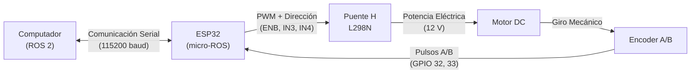
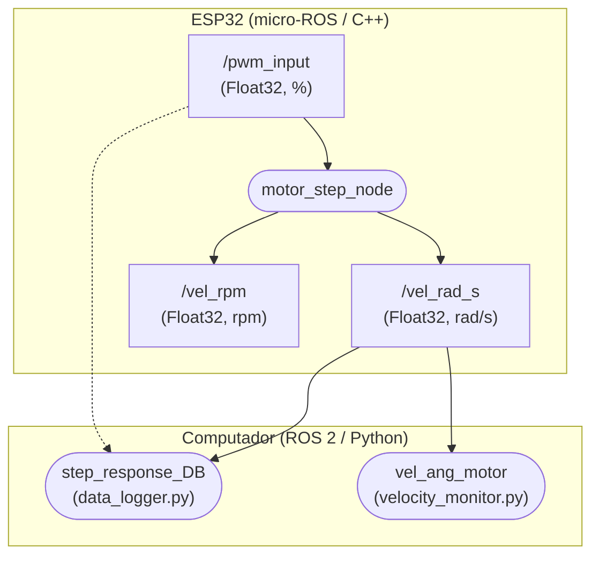

# Guía 0: Diseño de un Nodo micro-ROS para Motor DC

<div align="center">

**Asignatura:** Control Inteligente (`ING01343-ING278`)  
**Institución:** Politécnico Colombiano Jaime Isaza Cadavid — Facultad de Ingeniería  
**Docente:** Deimer Miranda Montoya, MSc.(c) — `deimer_miranda91162@elpoli.edu.co`  
**Período Académico:** 2026-2  
**Dedicación estimada:** 3 a 4 horas (Trabajo autónomo guiado e individual)  
**Plataforma:** Pop!_OS / Ubuntu 22.04 LTS + ROS 2 Humble + ESP32 + micro-ROS

</div>

---

## 1. Introducción

En un sistema de control no es suficiente con disponer de un algoritmo matemático. Para actuar sobre una planta real es necesario medir variables, procesar información y convertir las decisiones del controlador en señales capaces de accionar físicamente el sistema.

En esta práctica se diseñará e implementará un nodo micro-ROS sobre un microcontrolador ESP32 para interactuar con un motor DC. El montaje está compuesto por:

* Un computador con **Pop!_OS / Ubuntu 22.04 LTS** y **ROS 2 Humble**.
* Un **ESP32** ejecutando **micro-ROS**.
* Un puente H **L298N**.
* Un **motor DC** con caja reductora.
* Un **encoder incremental de cuadratura**.

El objetivo principal de la guía no es comenzar escribiendo código. Primero se comprenderá el sistema, posteriormente se establecerán las responsabilidades de cada componente, se diseñarán las interfaces de comunicación y, solamente después, estas decisiones se traducirán a una implementación en software.

> [!TIP]
> **Principio de Diseño:**
> El diseño de un nodo debe comenzar preguntando qué debe hacer, qué información necesita, qué información produce y cuándo debe procesarla.

---

### 1.1. Propósito de Aprendizaje

Al finalizar la práctica, el estudiante estará en capacidad de:

1. Explicar la arquitectura física y de software de un sistema distribuido **ROS 2 — micro-ROS**.
2. Establecer la responsabilidad de un nodo micro-ROS en un microcontrolador.
3. Diseñar tópicos, mensajes y unidades de ingeniería antes de programar.
4. Diferenciar callbacks, interrupciones de hardware (ISR), timers y executors.
5. Adquirir las señales de un encoder incremental en cuadratura.
6. Estimar velocidad angular en $\text{rad/s}$ y en $\text{rpm}$.
7. Accionar un motor DC mediante PWM y un puente H L298N.
8. Integrar el ESP32 con ROS 2 mediante `micro_ros_agent`.
9. Visualizar y almacenar experimentalmente la respuesta del sistema.

---

### 1.2. Relación con la Asignatura (Control Inteligente)

En un sistema de control de velocidad interesa comparar la velocidad deseada con la velocidad real de la planta:

$$e(t) = \omega_{\text{ref}}(t) - \omega(t)$$

Posteriormente, un controlador utiliza este error para determinar una acción de control $u(t)$.

Sin embargo, antes de implementar un controlador es necesario responder dos preguntas fundamentales:

$$\textbf{¿Cómo obtiene el sistema la velocidad del motor y cómo convierte una acción de control en movimiento físico?}$$

Esta práctica desarrolla precisamente esa infraestructura. La arquitectura obtenida servirá como base para la cadena metodológica:

$$\boxed{\text{Prueba Escalón} \longrightarrow \text{Datos CSV} \longrightarrow \text{Identificación Paramétrica} \longrightarrow \text{Modelo Matemático} \longrightarrow \text{Control en Lazo Cerrado}}$$

---

## 2. Conceptos Fundamentales de ROS 2 y micro-ROS

ROS 2 permite construir sistemas distribuidos mediante componentes modulares de software que intercambian información.

### Conceptos Clave:

* **Nodo:** Unidad lógica de ejecución encargada de una responsabilidad determinada.
* **Tópico:** Canal lógico unidireccional o multidireccional mediante el cual circula información entre nodos bajo el patrón publicador/suscriptor.
* **Mensaje:** Estructura de datos fuertemente tipada que define la organización de los datos intercambiados.
* **Publisher y Subscriber:** Mecanismos utilizados respectivamente para emitir y recibir mensajes en un tópico.

> [!NOTE]
> Un nodo no debe confundirse con un dispositivo físico. Un computador puede ejecutar múltiples nodos simultáneamente y el ESP32 ejecutará un nodo micro-ROS.


**Convención Gráfica:**
* **Elipses (`([ ... ])`):** Nodos ROS 2 o micro-ROS.
* **Rectángulos con bordes redondeados (`[ ... ]`):** Tópicos.
* **Rectángulos convencionales:** Componentes físicos o módulos de hardware.

---

### 2.1. ¿Qué aporta micro-ROS?

ROS 2 se ejecuta normalmente en computadores con sistemas operativos completos (Linux POSIX). Un microcontrolador como el ESP32 dispone de recursos limitados de memoria y cómputo.

micro-ROS permite integrar estos microcontroladores al ecosistema ROS 2 conservando conceptos estándar como:
* Nodos
* Publishers y Subscribers
* Mensajes tipados (`std_msgs`, `geometry_msgs`, etc.)
* Timers
* Executors

Esto permite que el ESP32 interactúe de forma transparente con otros nodos ROS 2 mientras se encarga de tareas de tiempo real estricto en el hardware.

---

### 2.2. micro-ROS Agent

El `micro_ros_agent` es un nodo ejecutable en el computador que actúa como intermediario entre el cliente micro-ROS del ESP32 y el middleware DDS de ROS 2:

$$\boxed{\text{ROS 2 (DDS)} \longleftrightarrow \text{micro-ROS Agent (PC)} \longleftrightarrow \text{ESP32 (micro-ROS Client)}}$$

> [!WARNING]
> El Agent no controla el motor, no calcula la velocidad y no genera PWM. Su única responsabilidad es permitir la comunicación y conversión de capas entre micro-ROS y el grafo de ROS 2.

---

## 3. Arquitectura Física del Sistema

El sistema se divide en procesamiento, comunicación, potencia, actuación y sensado:

| Elemento | Responsabilidad Principal |
| :--- | :--- |
| **Computador (PC)** | Ejecutar ROS 2 Humble, `micro_ros_agent` y los nodos de visualización, almacenamiento y control. |
| **ESP32** | Recibir PWM, atender interrupciones del encoder, calcular velocidades y modular PWM hacia el puente H. |
| **Puente H L298N** | Actuar como etapa de potencia entre el ESP32 y el motor DC. |
| **Motor DC** | Convertir energía eléctrica en movimiento mecánico rotacional. |
| **Encoder Incremental** | Convertir el giro del eje en trenes de pulsos digitales en cuadratura A/B. |



* **Cadena de accionamiento:**
  $$\boxed{\text{Procesamiento (ESP32)} \longrightarrow \text{Potencia (L298N)} \longrightarrow \text{Actuación (Motor DC)}}$$
* **Cadena de realimentación/sensado:**
  $$\boxed{\text{Movimiento (Eje)} \longrightarrow \text{Sensado (Encoder)} \longrightarrow \text{Procesamiento (ESP32)}}$$

### Asignación de Pines de Hardware:

| GPIO ESP32 | Señal | Elemento / Módulo | Descripción |
| :---: | :---: | :---: | :--- |
| `GPIO 25` | `ENB` | Puente H L298N | Modulación PWM (Canal LEDC 0, 500 Hz, 8 bits) |
| `GPIO 27` | `IN3` | Puente H L298N | Dirección de giro lógico |
| `GPIO 26` | `IN4` | Puente H L298N | Dirección de giro lógico |
| `GPIO 32` | `ENCA` (Canal A) | Encoder | Interrupción de hardware (`CHANGE`) |
| `GPIO 33` | `ENCB` (Canal B) | Encoder | Detección de sentido de giro |
| `GPIO 21` | `SDA` | Pantalla OLED SH1106 | Línea de datos $I^2C$ |
| `GPIO 22` | `SCL` | Pantalla OLED SH1106 | Línea de reloj $I^2C$ |

---

## 4. Arquitectura de Software del Laboratorio

El sistema distribuido separa claramente las tareas de tiempo real en el microcontrolador de las tareas de alto nivel en el computador:



> [!NOTE]
> **Pregunta de reflexión:**
> ¿Por qué resulta conveniente que la generación de gráficas en tiempo real y el almacenamiento de datos en archivos CSV se ejecuten en el computador y no dentro del ESP32?

---

## 5. Flujo de Información

Cuando se aplica un comando de entrada (por ejemplo $u = 50\,\%$):

1. Un nodo de ROS 2 en el PC publica el valor numérico en `/pwm_input`.
2. El nodo `motor_step_node` en el ESP32 recibe el mensaje a través de micro-ROS.
3. El executor despacha el callback de suscripción asociado.
4. El ESP32 aplica la dirección en `IN3`/`IN4` y el ciclo útil PWM en `ENB`.
5. El puente H L298N suministra la corriente requerida al motor DC.
6. El motor gira y el encoder genera pulsos digitales A y B.
7. Las interrupciones de hardware en el ESP32 actualizan el contador de ticks en tiempo real.
8. Un timer periódico (cada $T_s = 0.1\text{ s}$) calcula la velocidad angular en $\text{rad/s}$ y $\text{rpm}$.
9. El ESP32 publica los valores en `/vel_rad_s` y `/vel_rpm` y actualiza la pantalla OLED.
10. Los nodos en el computador reciben las velocidades para graficarlas y guardarlas en un archivo CSV.

$$\boxed{\text{PWM} \longrightarrow \text{Accionamiento} \longrightarrow \text{Movimiento} \longrightarrow \text{Encoder} \longrightarrow \text{Velocidad estimada} \longrightarrow \text{Publicación ROS 2}}$$

---

## 6. Diseño del Nodo micro-ROS (`motor_step_node`)

### Responsabilidades del nodo `motor_step_node`:
1. Recibir el comando de PWM desde el tópico `/pwm_input`.
2. Saturar la entrada dentro del rango seguro $[-100.0, 100.0]\,\%$.
3. Configurar los pines de dirección `IN3` e `IN4`.
4. Generar el ciclo útil PWM mediante el periférico LEDC del ESP32.
5. Adquirir las transiciones del encoder por interrupciones de hardware.
6. Calcular la velocidad angular en $\text{rad/s}$ y en $\text{rpm}$ cada periodo de muestreo $T_s$.
7. Publicar en los tópicos `/vel_rad_s` y `/vel_rpm`.
8. Refrescar localmente las mediciones en la pantalla OLED.

### Lo que NO debe hacer el nodo:
* No debe generar gráficas con librerías pesadas.
* No debe escribir archivos CSV ni gestionar sistemas de archivos.
* No debe ejecutar algoritmos de identificación offline.

---

## 7. Arquitectura Temporal del Nodo

| Evento | Mecanismo | Acción Ejecutada |
| :--- | :--- | :--- |
| **Llega nuevo PWM** | Callback de suscripción ROS | Actualizar la referencia de entrada y configurar pines de potencia |
| **Flanco del encoder** | ISR (*Interrupt Service Routine*) | Incrementar o decrementar el contador atómico de ticks |
| **Cada $T_s = 100\text{ ms}$** | Timer periódico micro-ROS | Calcular $\Delta N$, estimar $\omega$ y $n$, publicar tópicos y refrescar OLED |
| **Eventos disponibles** | Executor micro-ROS | Coordinar la ejecución ordenada de callbacks y timers |

### 7.1. Callback de Suscripción
Se ejecuta de forma asíncrona cuando un mensaje llega al tópico `/pwm_input`:

$$\text{Mensaje en } \texttt{/pwm\_input} \longrightarrow \text{Callback} \longrightarrow \text{Actualización de PWM y dirección}$$

### 7.2. Interrupciones e ISR (Encoder)
El encoder genera pulsos mecánicos rápidos que no pueden esperarse mediante lecturas secuenciales en un bucle (*polling*), pues se perderían cuentas durante otras operaciones:

$$\boxed{\text{Flanco en Canal A} \longrightarrow \text{ISR de hardware} \longrightarrow \text{Actualización de } \texttt{encoder\_count}}$$

```cpp
// Declaración de variable modificada en ISR
volatile int32_t encoder_count = 0;

void IRAM_ATTR encoderISR() {
    bool A = digitalRead(ENCA);
    bool B = digitalRead(ENCB);
    if (A != B) {
        encoder_count--;
    } else {
        encoder_count++;
    }
}
```

> [!CAUTION]
> Una ISR debe ser lo más breve y rápida posible. Nunca se deben incluir publicaciones ROS, retardos (`delay`), cálculos trigonométricos complejos ni escrituras en displays dentro de una ISR.

### 7.3. Timer Periódico ($T_s = 0.1\text{ s}$)
El cálculo de velocidad requiere un intervalo de tiempo conocido:

$$\text{Cada } T_s \longrightarrow \text{Leer contador protegido} \longrightarrow \text{Calcular } \omega \text{ y } n \longrightarrow \text{Publicar tópicos}$$

$$T_s = 0.1\text{ s} \implies f_s = \frac{1}{T_s} = 10\text{ Hz}$$

---

## 8. Diseño de Interfaces (Contrato de Tópicos)

| Tópico | Dirección (respecto al ESP32) | Tipo de Mensaje | Unidades | Propósito |
| :--- | :---: | :---: | :---: | :--- |
| `/pwm_input` | Entrada | `std_msgs/msg/Float32` | $\%$ | Comando de control aplicado al puente H ($-100.0$ a $100.0\,\%$) |
| `/vel_rad_s` | Salida | `std_msgs/msg/Float32` | $\text{rad/s}$ | Velocidad angular estimada del eje |
| `/vel_rpm` | Salida | `std_msgs/msg/Float32` | $\text{rpm}$ | Velocidad angular para monitoreo y visualización |

---

## 9. Lectura del Encoder y Estimación de Velocidad

El encoder incremental no entrega velocidad directamente, sino transiciones de pulso:

$$\boxed{\text{Movimiento mecánico} \longrightarrow \text{Pulsos A/B} \longrightarrow \text{Conteo de ticks} \longrightarrow \text{Estimación de velocidad}}$$

Definimos $N_{\text{rev}}$ como el número experimental de cuentas por revolución completa del eje de salida:

$$\Delta\theta_{\text{count}} = \frac{2\pi}{N_{\text{rev}}}\quad [\text{rad/tick}]$$

Si durante un intervalo $\Delta t$ se registran $\Delta N[k] = N[k] - N[k-1]$ cuentas:

$$\boxed{\omega[k] = \frac{2\pi \Delta N[k]}{N_{\text{rev}} \Delta t}\quad [\text{rad/s}]}$$

$$\boxed{n[k] = \frac{60 \Delta N[k]}{N_{\text{rev}} \Delta t} = \omega[k] \left(\frac{60}{2\pi}\right)\quad [\text{rpm}]}$$

> [!WARNING]
> Un error en el valor de $N_{\text{rev}}$ introduce un error sistemático de escala en toda la velocidad calculada y en los modelos identificados posteriormente.

---

## 10. Control del Puente H L298N

El ESP32 conmuta las señales de control lógico y modulación:

$$\boxed{\text{ESP32 (LEDC)} \longrightarrow \text{Puente H L298N} \longrightarrow \text{Motor DC}}$$

| Entrada $u$ ($\%$) | `IN3` | `IN4` | PWM (`ENB`) | Comportamiento |
| :---: | :---: | :---: | :---: | :--- |
| $u > 0$ | `LOW` | `HIGH` | $PWM_{\text{raw}}$ | Giro en sentido positivo |
| $u < 0$ | `HIGH` | `LOW` | $PWM_{\text{raw}}$ | Giro en sentido negativo |
| $u = 0$ | `LOW` | `LOW` | $0$ | Motor detenido / frenado |

Con resolución de 8 bits ($PWM_{\max} = 2^8 - 1 = 255$):

$$\boxed{PWM_{\text{raw}} = \text{int}\left(\frac{|u|}{100} \cdot 255\right)}$$

---

## 11. Implementación del Nodo en el Repositorio

El código fuente del firmware se encuentra ubicado en el repositorio en:

* **Configuración del proyecto PlatformIO:** [`firmware/esp32_motor_step/platformio.ini`](../../firmware/esp32_motor_step/platformio.ini)
* **Código fuente del firmware en C++:** [`firmware/esp32_motor_step/src/main.cpp`](../../firmware/esp32_motor_step/src/main.cpp)

---

## 12. Integración y Validación Experimental con ROS 2

### 12.1. Iniciar el micro-ROS Agent en el PC

```bash
source /opt/ros/humble/setup.bash
ros2 run micro_ros_agent micro_ros_agent serial --dev /dev/ttyUSB0 -b 115200
```

### 12.2. Verificar Grafo de Nodos y Tópicos

```bash
# Comprobar nodo activo
ros2 node list
# Debe retornar: /motor_step_node

# Comprobar tópicos
ros2 topic list
# Debe incluir: /pwm_input, /vel_rad_s, /vel_rpm

# Comprobar frecuencia de publicación
ros2 topic hz /vel_rad_s
# Debe reportar una tasa promedio estable de ~10 Hz
```

### 12.3. Accionamiento de Prueba

```bash
# Aplicar 30 % PWM
ros2 topic pub /pwm_input std_msgs/msg/Float32 "{data: 30.0}" --once

# Detener el motor
ros2 topic pub /pwm_input std_msgs/msg/Float32 "{data: 0.0}" --once
```

---

## 13. Nodos ROS 2 en el Computador

La arquitectura contempla nodos en Python dentro del paquete ROS 2 del repositorio:

1. **Monitor gráfico en tiempo real:**
   * Archivo: [`ros2_ws/src/dc_motor_experiments/dc_motor_experiments/velocity_monitor.py`](../../ros2_ws/src/dc_motor_experiments/dc_motor_experiments/velocity_monitor.py)
   * Tópico suscrito: `/vel_rad_s` o `/vel_rpm`.

2. **Registrador de datos a CSV:**
   * Archivo: [`ros2_ws/src/dc_motor_experiments/dc_motor_experiments/data_logger.py`](../../ros2_ws/src/dc_motor_experiments/dc_motor_experiments/data_logger.py)
   * Tópicos suscritos: `/vel_rad_s` y `/pwm_input`.
   * Estructura generada: `Time (s)`, `Angular Velocity (rad/s)`, `PWM (%)`.

---

## 14. Diagnóstico Básico por Capas

| Síntoma | Causa Probable | Verificación / Solución |
| :--- | :--- | :--- |
| El nodo no aparece en `ros2 node list` | Fallo de conexión serie o Agent no iniciado | Verificar cable USB, puerto `/dev/ttyUSB0` y permisos `chmod 666 /dev/ttyUSB0`. |
| Nodo visible pero velocidad siempre en cero | Encoder sin alimentación o pines invertidos | Revisar conexión de 3.3V/5V del encoder, interrupciones en `GPIO 32/33`. |
| El motor no gira ante comando PWM | Alimentación de potencia o puente H deshabilitado | Comprobar fuente de 12V externa, masa común con ESP32 y jumper de `ENB`. |
| Velocidad calculada errónea o con escala incorrecta | $N_{\text{rev}}$ no coincide con la calibración | Ejecutar la rutina de calibración de pulsos por revolución. |
| El signo de velocidad no coincide con el sentido de giro | Canales A y B invertidos físicamente o en código | Intercambiar los pines de definición `ENCA` y `ENCB` en el firmware. |

---

## 15. Actividades de Laboratorio

### Actividad 1: Diseño de Arquitectura
Dibujar el diagrama de bloques del sistema distribuido identificando claramente la frontera entre el microcontrolador (ESP32) y el computador, sus respectivos nodos, tópicos y mensajes.

### Actividad 2: Calibración del Encoder
Determinar experimentalmente $N_{\text{rev}}$ girando el eje una revolución completa y promediando múltiples mediciones.

### Actividad 3: Integración y Verificación por Capas
Validar en secuencia: Agent $\rightarrow$ Nodo $\rightarrow$ Tópicos $\rightarrow$ Encoder manual $\rightarrow$ Accionamiento con PWM.

### Actividad 4: Prueba Experimental de Escalón
Aplicar un escalón de PWM, almacenar el archivo CSV resultante y analizar el régimen transitorio y el régimen permanente de velocidad angular.

---

## 16. Síntesis y Conclusiones

$$\boxed{\text{Comprender la Planta} \longrightarrow \text{Diseñar Interfaces} \longrightarrow \text{Implementar Firmware} \longrightarrow \text{Integrar con ROS 2} \longrightarrow \text{Validar Experimentalmente}}$$

El nodo `motor_step_node` implementado en el ESP32 constituye el núcleo de instrumentación y actuación sobre el cual se construirán las siguientes fases del proyecto: la identificación experimental paramétrica (FOP / FOPDT) y el diseño e implementación de controladores en lazo cerrado.
