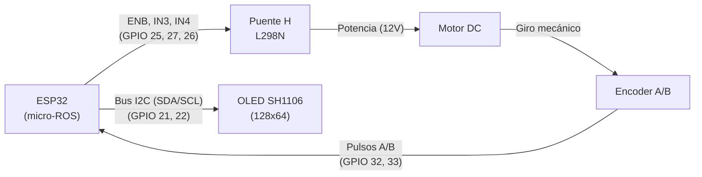
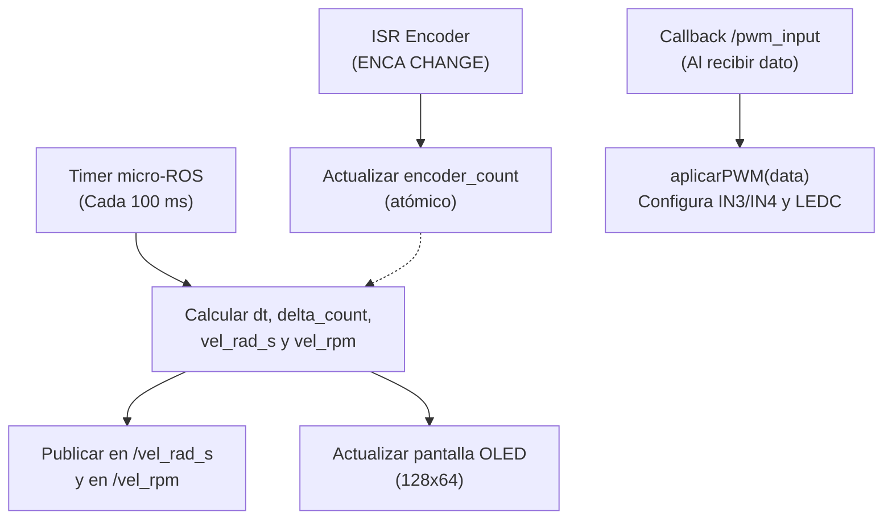

# Guía 1: Nodo micro-ROS para Motor DC

<div align="center">

**Asignatura:** Control Inteligente (`ING01343-ING278`)  
**Institución:** Politécnico Colombiano Jaime Isaza Cadavid — Facultad de Ingeniería  
**Docente:** Deimer Miranda Montoya, MSc.(c) — `deimer_miranda91162@elpoli.edu.co`  
**Período Académico:** 2026-2  
**Modalidad:** Laboratorio guiado  
**Entregable:** Nodo `motor_step_node` funcional con calibración experimental ($N_{\text{rev}} = 960$), PWM, medición de velocidad y display OLED SH1106

</div>

---

## 1. Introducción

Antes de diseñar un controlador de velocidad es necesario disponer de una infraestructura capaz de actuar sobre el motor y medir correctamente su respuesta. En esta guía se construirá un nodo micro-ROS sobre un microcontrolador ESP32 para accionar un motor DC mediante PWM, determinar el sentido de giro, medir la velocidad angular a partir de un encoder incremental en cuadratura y publicar las variables de interés hacia ROS 2.

El trabajo se desarrollará de manera progresiva:
1. Calibración experimental del encoder ($N_{\text{rev}}$).
2. Implementación de la medición de velocidad angular en $\text{rad/s}$ y $\text{rpm}$.
3. Accionamiento del motor con modulación LEDC y puente H L298N.
4. Integración de interfaces micro-ROS (suscripción a `/pwm_input`, publicación en `/vel_rad_s` y `/vel_rpm`).
5. Visualización local en una pantalla OLED SH1106 conectada por $I^2C$.

> [!NOTE]
> En esta práctica no se implementará todavía un controlador en lazo cerrado. El objetivo es construir y validar rigurosamente la infraestructura física y de software que permitirá posteriormente modelar la planta y cerrar el lazo de control.

---

### 1.1. Propósito de Aprendizaje

Al finalizar la guía, el estudiante estará en capacidad de:

1. Interpretar las señales A/B en cuadratura de un encoder incremental.
2. Utilizar interrupciones de hardware (`CHANGE`) para registrar el movimiento sin pérdida de cuentas.
3. Determinar experimentalmente las cuentas por revolución ($N_{\text{rev}}$) del eje del motor.
4. Estimar velocidad angular en $\text{rad/s}$ y en $\text{rpm}$.
5. Explicar la relación entre periodo de muestreo $T_s$ y la resolución en la estimación de velocidad.
6. Configurar PWM mediante el periférico LEDC del ESP32 ($500\text{ Hz}$, $8\text{ bits}$).
7. Accionar un motor DC en ambos sentidos de giro mediante un puente H L298N.
8. Implementar un subscriber y dos publishers en micro-ROS sobre FreeRTOS/Arduino.
9. Verificar el funcionamiento del nodo y la coherencia de los datos desde ROS 2.
10. Visualizar localmente PWM, rpm y rad/s en una pantalla OLED SH1106 ($128\times 64$).

---

## 2. Sistema de Trabajo

El montaje experimental está compuesto por un ESP32, un módulo puente H L298N, un motor DC con encoder incremental integrado y una pantalla OLED SH1106 conectada por el bus $I^2C$. El ESP32 ejecutará el nodo micro-ROS `motor_step_node`.

### 2.1. Asignación de Pines de Hardware

| GPIO ESP32 | Señal | Elemento | Descripción de la Conexión |
| :---: | :---: | :---: | :--- |
| `GPIO 32` | `ENCA` | Encoder Canal A | Entrada de pulsos con interrupción de hardware (`CHANGE`) |
| `GPIO 33` | `ENCB` | Encoder Canal B | Entrada de pulsos para determinar el sentido de giro |
| `GPIO 25` | `ENB` | Puente H L298N | Modulación PWM (Canal LEDC 0, 500 Hz, 8 bits) |
| `GPIO 27` | `IN3` | Puente H L298N | Nivel lógico de dirección de giro |
| `GPIO 26` | `IN4` | Puente H L298N | Nivel lógico de dirección de giro |
| `GPIO 21` | `SDA` | Pantalla OLED SH1106 | Línea de datos $I^2C$ |
| `GPIO 22` | `SCL` | Pantalla OLED SH1106 | Línea de reloj $I^2C$ |



> [!CAUTION]
> **Referencia de Tierra Común:**
> El ESP32 y la fuente externa del puente H deben compartir obligatoriamente la misma referencia de tierra (`GND`). La alimentación de potencia del motor nunca debe extraerse de los pines de 3.3V o 5V del microcontrolador.

---

## 3. Arquitectura micro-ROS de la Guía

Se conservará la siguiente interfaz estándar durante toda la práctica:


### Contrato de Comunicación del Nodo:

| Tópico | Dirección | Tipo de Mensaje | Rango / Unidades | Descripción |
| :--- | :---: | :---: | :---: | :--- |
| `/pwm_input` | Entrada | `std_msgs/msg/Float32` | $[-100.0, 100.0]\,\%$ | PWM de referencia firmado |
| `/vel_rad_s` | Salida | `std_msgs/msg/Float32` | $\text{rad/s}$ | Velocidad angular estimada por el encoder |
| `/vel_rpm` | Salida | `std_msgs/msg/Float32` | $\text{rpm}$ | Velocidad angular en revoluciones por minuto |

> [!TIP]
> Un valor positivo de `/pwm_input` produce un sentido de giro definido y un valor negativo produce el giro inverso. El signo de la velocidad angular medida se conserva para mantener la coherencia direccional en todo el sistema.

---

## 4. Encoder Incremental e Interrupciones

El encoder no entrega directamente una velocidad. Genera dos señales digitales cuadradas desfasadas $90^\circ$ entre sí (denominadas A y B):

```text
Señal A:  ___|‾‾‾|___|‾‾‾|___|‾‾‾|___
Señal B:  _____|‾‾‾|___|‾‾‾|___|‾‾‾|_
                  ---> Tiempo (t)
```

En esta implementación, el Canal A genera una interrupción de hardware en cada cambio de estado (`CHANGE`), y dentro de la rutina de servicio a la interrupción (ISR) se consulta el estado lógico del Canal B para incrementar o decrementar el contador:

```cpp
attachInterrupt(digitalPinToInterrupt(ENCA), encoderISR, CHANGE);
```

### Rutina de Servicio a la Interrupción (ISR):

```cpp
void IRAM_ATTR encoderISR() {
    bool A = digitalRead(ENCA);
    bool B = digitalRead(ENCB);

    if (A != B) {
        encoder_count--;
    } else {
        encoder_count++;
    }
}
```

Con esta configuración se adopta la convención:

$$\Delta N > 0 \implies \omega > 0 \qquad\text{y}\qquad \Delta N < 0 \implies \omega < 0$$

> [!WARNING]
> El signo positivo no es una propiedad universal del sensor; depende de la polaridad de las conexiones de los canales A/B, del montaje mecánico y de la convención lógica en la ISR. Lo fundamental es mantener una convención consistente entre la entrada y la salida.

### ¿Por qué usar una ISR?
Los flancos del encoder ocurren por el giro mecánico y pueden darse mientras el CPU procesa otras instrucciones. La interrupción permite registrar cada pulso de inmediato. La variable compartida debe declararse como `volatile`:

```cpp
volatile int32_t encoder_count = 0;
```

> [!NOTE]
> **Pregunta de reflexión:**
> ¿Por qué no es conveniente calcular la velocidad, escribir en la pantalla OLED o publicar un mensaje ROS directamente dentro de la ISR?

---

## 5. Calibración Experimental: Cuentas por Revolución ($N_{\text{rev}}$)

Antes de calcular velocidad es indispensable determinar experimentalmente el número de cuentas registradas por una revolución completa del eje ($N_{\text{rev}}$).

Este valor depende del número de ranuras o polos del sensor magnético, de la relación de reducción de la caja de engranajes ($GR$) y del modo de interrupción (`CHANGE` sobre el Canal A genera 2 cuentas por ciclo del encoder).

### 5.1. Programa de Calibración por Serial

Ubicación del código de calibración en el repositorio:
* Archivo de calibración: [`stage_01_motor_instrumentation/calibration/encoder_calibration.md`](../../stage_01_motor_instrumentation/calibration/encoder_calibration.md)

```cpp
#include <Arduino.h>

#define ENCA 32
#define ENCB 33

volatile int32_t encoder_count = 0;

void IRAM_ATTR encoderISR() {
    bool A = digitalRead(ENCA);
    bool B = digitalRead(ENCB);
    if (A != B) {
        encoder_count--;
    } else {
        encoder_count++;
    }
}

void setup() {
    Serial.begin(115200);
    pinMode(ENCA, INPUT_PULLUP);
    pinMode(ENCB, INPUT_PULLUP);

    attachInterrupt(digitalPinToInterrupt(ENCA), encoderISR, CHANGE);

    Serial.println("=== CALIBRACION DEL ENCODER ===");
    Serial.println("R: reiniciar contador");
}

void loop() {
    if (Serial.available() > 0) {
        char comando = Serial.read();
        if (comando == 'R' || comando == 'r') {
            noInterrupts();
            encoder_count = 0;
            interrupts();
            Serial.println("Contador reiniciado a 0");
        }
    }

    noInterrupts();
    int32_t ticks = encoder_count;
    interrupts();

    static unsigned long previous_print_ms = 0;
    unsigned long current_time_ms = millis();

    if (current_time_ms - previous_print_ms >= 200) {
        previous_print_ms = current_time_ms;
        Serial.print("Ticks: ");
        Serial.println(ticks);
    }
}
```

### 5.2. Procedimiento Experimental de Calibración:

1. Cargar el programa de calibración en el ESP32.
2. Abrir el monitor serial a `115200 baud`.
3. Colocar una marca visual de alineación en el eje del motor respecto a una referencia fija.
4. Enviar el carácter `R` para reiniciar el contador a cero.
5. Girar manualmente el eje exactamente una revolución completa ($360^\circ$).
6. Registrar el valor final de `Ticks`.
7. Repetir el procedimiento 5 veces.

| Ensayo | Ticks Medidos ($N_i$) | $\lvert N_i \rvert$ |
| :---: | :---: | :---: |
| 1 | 960 | 960 |
| 2 | 960 | 960 |
| 3 | 960 | 960 |
| 4 | 960 | 960 |
| 5 | 960 | 960 |

$$\boxed{N_{\text{rev}} = \frac{\sum_{i=1}^5 \lvert N_i \rvert}{5} = 960\ \text{ticks/rev}}$$

En el firmware principal se establece:

```cpp
const float COUNTS_PER_REV = 960.0f;
```

---

## 6. Estimación de Velocidad Angular

El contador acumula posición. La velocidad se calcula a partir del desplazamiento angular ocurrido entre dos instantes de muestreo:

$$\Delta N[k] = N[k] - N[k-1]$$

$$\Delta\theta[k] = \frac{2\pi \Delta N[k]}{N_{\text{rev}}}\quad [\text{rad}]$$

$$\boxed{\omega[k] = \frac{2\pi \Delta N[k]}{N_{\text{rev}} \Delta t}\quad [\text{rad/s}]}$$

$$\boxed{n[k] = \frac{60 \Delta N[k]}{N_{\text{rev}} \Delta t} = \omega[k]\left(\frac{60}{2\pi}\right)\quad [\text{rpm}]}$$

### 6.1. Muestreo a 10 Hz ($T_s = 0.1\text{ s}$) y Medición Real de $\Delta t$

Aunque el timer de micro-ROS se configura para dispararse cada $100\text{ ms}$, el tiempo transcurrido real se mide con `millis()` para compensar pequeñas fluctuaciones del planificador:

```cpp
unsigned long current_time_ms = millis();
float dt = (current_time_ms - previous_time_ms) * 0.001f;
previous_time_ms = current_time_ms;
```

### 6.2. Lectura Segura (Sección Crítica)

Como `encoder_count` se modifica en la ISR de forma asíncrona, se accede a ella protegiendo la lectura:

```cpp
noInterrupts();
int32_t current_count = encoder_count;
interrupts();

int32_t delta_count = current_count - previous_count;
previous_count = current_count;
```

---

## 7. Accionamiento del Motor Mediante PWM (LEDC)

Para controlar la velocidad del motor DC mediante el puente H L298N se configura el periférico LEDC del ESP32:

```cpp
const int canal_pwm = 0;
const int frecuencia_pwm = 500; // 500 Hz
const int resolucion_pwm = 8;   // 8 bits (0 - 255)

ledcSetup(canal_pwm, frecuencia_pwm, resolucion_pwm);
ledcAttachPin(ENB, canal_pwm);
```

La referencia de entrada recibida en `/pwm_input` está en porcentaje $[-100.0, 100.0]\,\%$ y se convierte a la escala de 8 bits:

$$\boxed{PWM_{\text{raw}} = \text{int}\left(\frac{|u|}{100} \cdot 255\right)}$$

| $u$ ($\%$) | `IN3` (`GPIO 27`) | `IN4` (`GPIO 26`) | `ENB` (`GPIO 25`) | Resultado |
| :---: | :---: | :---: | :---: | :--- |
| $u > 0$ | `LOW` | `HIGH` | $PWM_{\text{raw}}$ | Giro en sentido positivo |
| $u < 0$ | `HIGH` | `LOW` | $PWM_{\text{raw}}$ | Giro en sentido negativo |
| $u = 0$ | `LOW` | `LOW` | $0$ | Motor detenido |

### Código Mínimo de Verificación de Hardware:

```cpp
#include <Arduino.h>

#define ENB 25
#define IN3 27
#define IN4 26

const int canal_pwm = 0;

void setup() {
    pinMode(IN3, OUTPUT);
    pinMode(IN4, OUTPUT);
    ledcSetup(canal_pwm, 500, 8);
    ledcAttachPin(ENB, canal_pwm);

    digitalWrite(IN3, LOW);
    digitalWrite(IN4, HIGH);
    ledcWrite(canal_pwm, 150); // Giro de prueba a ~58%
}

void loop() {}
```

---

## 8. Diseño Temporal de `motor_step_node`



---

## 9. Visualización Local en OLED SH1106 ($I^2C$)

La pantalla OLED SH1106 ($128\times 64$) muestra la información en tiempo real sin interferir en los tiempos de micro-ROS:

```text
+-----------------------+
|   --- MOTOR STEP ---  |
| PWM Ref:   45.0 %     |
| RPM:      125.4       |
| Vel:       13.13 rad/s|
+-----------------------+
```

---

## 10. Implementación Final en el Repositorio

Los archivos del firmware están listos para ser utilizados en:

* **Configuración del proyecto:** [`firmware/esp32_motor_step/platformio.ini`](../../firmware/esp32_motor_step/platformio.ini)
* **Código fuente del firmware:** [`firmware/esp32_motor_step/src/main.cpp`](../../firmware/esp32_motor_step/src/main.cpp)

---

## 11. Procedimiento de Integración y Verificación Paso a Paso

1. **Iniciar el micro-ROS Agent:**
   ```bash
   ros2 run micro_ros_agent micro_ros_agent serial --dev /dev/ttyUSB0 -b 115200
   ```
2. **Verificar que el nodo y los tópicos existan:**
   ```bash
   ros2 node list      # Debe aparecer: /motor_step_node
   ros2 topic list     # Debe mostrar: /pwm_input, /vel_rad_s, /vel_rpm
   ```
3. **Verificar tasa de muestreo (10 Hz):**
   ```bash
   ros2 topic hz /vel_rad_s
   ```
4. **Accionamiento en sentido positivo (40% PWM):**
   ```bash
   ros2 topic pub /pwm_input std_msgs/msg/Float32 "{data: 40.0}" --once
   ```
5. **Detención segura (0% PWM):**
   ```bash
   ros2 topic pub /pwm_input std_msgs/msg/Float32 "{data: 0.0}" --once
   ```
6. **Accionamiento en sentido inverso (-40% PWM):**
   ```bash
   ros2 topic pub /pwm_input std_msgs/msg/Float32 "{data: -40.0}" --once
   ```
7. **Verificar equivalencia matemática entre $\text{rpm}$ y $\text{rad/s}$:**
   $$\omega = n \cdot \frac{2\pi}{60}$$

---

## 12. Análisis y Discusión

1. ¿Por qué $N_{\text{rev}}$ debe determinarse experimentalmente con el mismo modo de interrupción (`CHANGE`) que se utilizará en el firmware final?
2. ¿Qué ocurriría con la escala de velocidad si se asumiera un valor de cuentas por revolución dos veces mayor al real?
3. ¿Por qué debe conservarse el signo de $\Delta N[k]$ en lugar de calcular su valor absoluto?
4. ¿Cuál es la diferencia de ejecución entre la ISR del encoder y el callback de `/pwm_input`?
5. ¿Qué ventaja tiene medir el $\Delta t$ real transcurrido con `millis()` frente a asumir un valor constante de $0.1\text{ s}$?
6. ¿Por qué la pantalla OLED debe considerarse una interfaz pasiva y nunca una etapa de medición o control?

---

## 13. Cierre y Resultado Esperado

$$\boxed{\text{Comando PWM en ROS 2} \longrightarrow \text{Puente H L298N} \longrightarrow \text{Motor DC} \longrightarrow \text{Encoder en Cuadratura} \longrightarrow \text{Publicación de } \omega(t)\text{ a 10 Hz}}$$

Al completar esta guía se cuenta con una plataforma de instrumentación robusta y calibrada, lista para la adquisición automatizada de datos y la identificación de funciones de transferencia de primer orden con y sin retardo (FOP / FOPDT).
