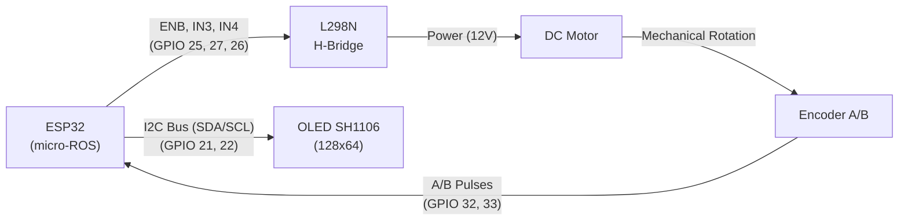
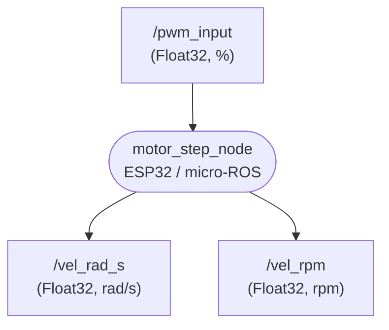
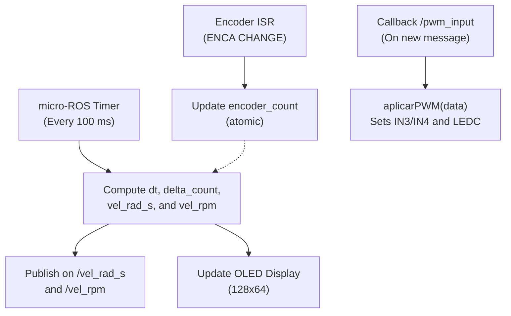

# Guide 1: micro-ROS Node for a DC Motor

<div align="center">

**Course:** Intelligent Control (`ING01343-ING278`)  
**Institution:** Politécnico Colombiano Jaime Isaza Cadavid — Faculty of Engineering  
**Instructor:** Deimer Miranda Montoya, MSc.(c) — `deimer_miranda91162@elpoli.edu.co`  
**Academic Period:** 2026-2  
**Format:** Guided Laboratory  
**Deliverable:** Functional `motor_step_node` with experimental calibration ($N_{\text{rev}} = 960$), PWM control, speed measurement, and local SH1106 OLED display

</div>

---

## 1. Introduction

Before designing a closed-loop speed controller, it is essential to build an infrastructure capable of driving the motor and measuring its dynamic response reliably. In this guide, a micro-ROS node will be built on an ESP32 microcontroller to drive a DC motor using PWM, detect rotation direction, measure angular velocity from an incremental quadrature encoder, and publish telemetry to ROS 2.

The work will proceed systematically:
1. Experimental encoder calibration ($N_{\text{rev}}$).
2. Implementation of angular velocity estimation in $\text{rad/s}$ and $\text{rpm}$.
3. Motor actuation using ESP32 LEDC PWM and an L298N H-Bridge driver.
4. Integration of micro-ROS interfaces (subscription to `/pwm_input`, publication on `/vel_rad_s` and `/vel_rpm`).
5. Local real-time telemetry on an SH1106 OLED display over $I^2C$.

> [!NOTE]
> In this lab, we do not yet implement a closed-loop controller. The objective is to build and validate the physical and software instrumentation that will enable modeling and feedback control in subsequent stages.

---

### 1.1. Learning Objectives

By the end of this guide, the student will be able to:

1. Interpret quadrature A/B signals from an incremental encoder.
2. Use hardware interrupts (`CHANGE`) to capture motion without losing counts.
3. Determine experimentally the counts per output shaft revolution ($N_{\text{rev}}$).
4. Estimate angular velocity in $\text{rad/s}$ and in $\text{rpm}$.
5. Explain the trade-off between sampling period $T_s$ and speed resolution.
6. Configure PWM via the ESP32 LEDC peripheral ($500\text{ Hz}$, $8\text{ bits}$).
7. Drive a DC motor in both directions using an L298N H-Bridge.
8. Implement a subscriber and two publishers in micro-ROS over FreeRTOS/Arduino.
9. Verify node operation and data consistency from ROS 2.
10. Display PWM, rpm, and rad/s on an SH1106 OLED screen ($128\times 64$).

---

## 2. Experimental Setup

The experimental setup consists of an ESP32, an L298N H-Bridge module, a DC motor with an integrated incremental encoder, and an SH1106 OLED display connected over $I^2C$. The ESP32 executes the `motor_step_node` micro-ROS node.

### 2.1. Hardware Pinout Allocation

| ESP32 GPIO | Signal | Component | Connection Description |
| :---: | :---: | :---: | :--- |
| `GPIO 32` | `ENCA` | Encoder Channel A | Hardware interrupt pulse input (`CHANGE`) |
| `GPIO 33` | `ENCB` | Encoder Channel B | Direction sensing pulse input |
| `GPIO 25` | `ENB` | L298N H-Bridge | PWM modulation (LEDC Channel 0, 500 Hz, 8 bits) |
| `GPIO 27` | `IN3` | L298N H-Bridge | Direction logic level |
| `GPIO 26` | `IN4` | L298N H-Bridge | Direction logic level |
| `GPIO 21` | `SDA` | OLED SH1106 Display | $I^2C$ Data line |
| `GPIO 22` | `SCL` | OLED SH1106 Display | $I^2C$ Clock line |



> [!CAUTION]
> **Common Ground Reference:**
> The ESP32 and the external power supply driving the H-Bridge must share a common ground (`GND`). Motor power must never be drawn directly from the 3.3V or 5V pins of the ESP32.

---

## 3. micro-ROS Architecture

The following communication interface will be used throughout the project:



### Node Communication Contract:

| Topic | Direction | Message Type | Range / Units | Description |
| :--- | :---: | :---: | :---: | :--- |
| `/pwm_input` | Input | `std_msgs/msg/Float32` | $[-100.0, 100.0]\,\%$ | Signed reference PWM percentage |
| `/vel_rad_s` | Output | `std_msgs/msg/Float32` | $\text{rad/s}$ | Estimated shaft angular velocity |
| `/vel_rpm` | Output | `std_msgs/msg/Float32` | $\text{rpm}$ | Estimated shaft angular velocity |

> [!TIP]
> A positive `/pwm_input` produces rotation in the designated forward direction, while a negative value reverses rotation. The sign of the measured velocity is preserved to maintain consistent directional awareness across the system.

---

## 4. Incremental Encoder and Interrupts

The encoder outputs two $90^\circ$ out-of-phase square waves (channels A and B):

```text
Channel A:  ___|‾‾‾|___|‾‾‾|___|‾‾‾|___
Channel B:  _____|‾‾‾|___|‾‾‾|___|‾‾‾|_
                  ---> Time (t)
```

In this implementation, Channel A triggers a hardware interrupt on every state change (`CHANGE`). Inside the interrupt service routine (ISR), Channel B is read to increment or decrement the tick counter:

```cpp
attachInterrupt(digitalPinToInterrupt(ENCA), encoderISR, CHANGE);
```

### Interrupt Service Routine (ISR):

```cpp
void IRAM_ATTR encoderISR() {
    bool A = digitalRead(ENCA);
    bool B = digitalRead(ENCB);

    if (A != B) {
        encoder_count--;
    } else {
        encoder_count++;
    }
}
```

This establishes the sign convention:

$$\Delta N > 0 \implies \omega > 0 \qquad\text{and}\qquad \Delta N < 0 \implies \omega < 0$$

> [!WARNING]
> Positive sign is not an absolute sensor property; it depends on the wiring of channels A/B, gearbox mounting, and the ISR logic. The key requirement is maintaining sign consistency between actuation and sensing.

### Why use an ISR?
Encoder pulses occur due to physical motion and may arrive while the CPU executes other code. Interrupts ensure zero pulse loss. The shared counter variable must be declared `volatile`:

```cpp
volatile int32_t encoder_count = 0;
```

> [!NOTE]
> **Reflection Question:**
> Why is it inappropriate to compute velocity, update the OLED display, or publish ROS messages directly inside the ISR?

---

## 5. Experimental Calibration: Counts per Revolution ($N_{\text{rev}}$)

Before estimating velocity, the number of counts generated by one complete revolution of the output shaft ($N_{\text{rev}}$) must be determined experimentally.

This value depends on sensor resolution, gearbox reduction ratio ($GR$), and the interrupt mode (`CHANGE` on channel A produces 2 counts per encoder cycle).

### 5.1. Calibration Program over Serial

* Calibration guide location: [`stage_01_motor_instrumentation/calibration/encoder_calibration.md`](../../stage_01_motor_instrumentation/calibration/encoder_calibration.md)

```cpp
#include <Arduino.h>

#define ENCA 32
#define ENCB 33

volatile int32_t encoder_count = 0;

void IRAM_ATTR encoderISR() {
    bool A = digitalRead(ENCA);
    bool B = digitalRead(ENCB);
    if (A != B) {
        encoder_count--;
    } else {
        encoder_count++;
    }
}

void setup() {
    Serial.begin(115200);
    pinMode(ENCA, INPUT_PULLUP);
    pinMode(ENCB, INPUT_PULLUP);

    attachInterrupt(digitalPinToInterrupt(ENCA), encoderISR, CHANGE);

    Serial.println("=== ENCODER CALIBRATION ===");
    Serial.println("R: Reset counter");
}

void loop() {
    if (Serial.available() > 0) {
        char cmd = Serial.read();
        if (cmd == 'R' || cmd == 'r') {
            noInterrupts();
            encoder_count = 0;
            interrupts();
            Serial.println("Counter reset to 0");
        }
    }

    noInterrupts();
    int32_t ticks = encoder_count;
    interrupts();

    static unsigned long previous_print_ms = 0;
    unsigned long current_time_ms = millis();

    if (current_time_ms - previous_print_ms >= 200) {
        previous_print_ms = current_time_ms;
        Serial.print("Ticks: ");
        Serial.println(ticks);
    }
}
```

### 5.2. Experimental Calibration Procedure:

1. Flash the calibration program to the ESP32.
2. Open the Serial Monitor at `115200 baud`.
3. Align a visual mark on the motor shaft with a fixed mechanical reference.
4. Send the character `R` to reset the counter.
5. Manually turn the shaft exactly one full revolution ($360^\circ$).
6. Record the final `Ticks` count.
7. Repeat the procedure 5 times.

| Trial | Measured Ticks ($N_i$) | $\lvert N_i \rvert$ |
| :---: | :---: | :---: |
| 1 | 960 | 960 |
| 2 | 960 | 960 |
| 3 | 960 | 960 |
| 4 | 960 | 960 |
| 5 | 960 | 960 |

$$\boxed{N_{\text{rev}} = \frac{\sum_{i=1}^5 \lvert N_i \rvert}{5} = 960\ \text{ticks/rev}}$$

In the main firmware, set:

```cpp
const float COUNTS_PER_REV = 960.0f;
```

---

## 6. Angular Velocity Estimation

The counter tracks incremental position. Velocity is calculated from the angular displacement during a sample window:

$$\Delta N[k] = N[k] - N[k-1]$$

$$\Delta\theta[k] = \frac{2\pi \Delta N[k]}{N_{\text{rev}}}\quad [\text{rad}]$$

$$\boxed{\omega[k] = \frac{2\pi \Delta N[k]}{N_{\text{rev}} \Delta t}\quad [\text{rad/s}]}$$

$$\boxed{n[k] = \frac{60 \Delta N[k]}{N_{\text{rev}} \Delta t} = \omega[k]\left(\frac{60}{2\pi}\right)\quad [\text{rpm}]}$$

### 6.1. 10 Hz Sampling ($T_s = 0.1\text{ s}$) and Real $\Delta t$ Timing

While the micro-ROS timer triggers every $100\text{ ms}$, real elapsed time is measured using `millis()` to compensate for scheduler jitter:

```cpp
unsigned long current_time_ms = millis();
float dt = (current_time_ms - previous_time_ms) * 0.001f;
previous_time_ms = current_time_ms;
```

### 6.2. Critical Section Protection

Because `encoder_count` is updated in the ISR, reading it requires an atomic copy:

```cpp
noInterrupts();
int32_t current_count = encoder_count;
interrupts();

int32_t delta_count = current_count - previous_count;
previous_count = current_count;
```

---

## 7. Motor Actuation via LEDC PWM

To control motor speed using the L298N driver, the ESP32 LEDC peripheral is configured:

```cpp
const int canal_pwm = 0;
const int frecuencia_pwm = 500; // 500 Hz
const int resolucion_pwm = 8;   // 8 bits (0 - 255)

ledcSetup(canal_pwm, frecuencia_pwm, resolucion_pwm);
ledcAttachPin(ENB, canal_pwm);
```

The signed percentage input from `/pwm_input` ($[-100.0, 100.0]\,\%$) is converted to an 8-bit integer:

$$\boxed{PWM_{\text{raw}} = \text{int}\left(\frac{|u|}{100} \cdot 255\right)}$$

| $u$ ($\%$) | `IN3` (`GPIO 27`) | `IN4` (`GPIO 26`) | `ENB` (`GPIO 25`) | Result |
| :---: | :---: | :---: | :---: | :--- |
| $u > 0$ | `LOW` | `HIGH` | $PWM_{\text{raw}}$ | Forward / Positive Rotation |
| $u < 0$ | `HIGH` | `LOW` | $PWM_{\text{raw}}$ | Reverse / Negative Rotation |
| $u = 0$ | `LOW` | `LOW` | $0$ | Motor Stopped |

### Hardware Verification Code:

```cpp
#include <Arduino.h>

#define ENB 25
#define IN3 27
#define IN4 26

const int canal_pwm = 0;

void setup() {
    pinMode(IN3, OUTPUT);
    pinMode(IN4, OUTPUT);
    ledcSetup(canal_pwm, 500, 8);
    ledcAttachPin(ENB, canal_pwm);

    digitalWrite(IN3, LOW);
    digitalWrite(IN4, HIGH);
    ledcWrite(canal_pwm, 150); // Spin test at ~58%
}

void loop() {}
```

---

## 8. Temporal Design of `motor_step_node`



---

## 9. Local Display on SH1106 OLED ($I^2C$)

The $128\times 64$ OLED screen provides local diagnostics without interrupting micro-ROS:

```text
+-----------------------+
|   --- MOTOR STEP ---  |
| PWM Ref:   45.0 %     |
| RPM:      125.4       |
| Vel:       13.13 rad/s|
+-----------------------+
```

---

## 10. Firmware Location in Repository

* **PlatformIO Config:** [`firmware/esp32_motor_step/platformio.ini`](../../firmware/esp32_motor_step/platformio.ini)
* **Firmware C++ Source:** [`firmware/esp32_motor_step/src/main.cpp`](../../firmware/esp32_motor_step/src/main.cpp)

---

## 11. Step-by-Step Integration and Verification

1. **Start micro-ROS Agent:**
   ```bash
   ros2 run micro_ros_agent micro_ros_agent serial --dev /dev/ttyUSB0 -b 115200
   ```
2. **Verify node and topics:**
   ```bash
   ros2 node list      # Must show: /motor_step_node
   ros2 topic list     # Must show: /pwm_input, /vel_rad_s, /vel_rpm
   ```
3. **Verify sample rate (10 Hz):**
   ```bash
   ros2 topic hz /vel_rad_s
   ```
4. **Positive actuation test (40% PWM):**
   ```bash
   ros2 topic pub /pwm_input std_msgs/msg/Float32 "{data: 40.0}" --once
   ```
5. **Safe stop test (0% PWM):**
   ```bash
   ros2 topic pub /pwm_input std_msgs/msg/Float32 "{data: 0.0}" --once
   ```
6. **Reverse actuation test (-40% PWM):**
   ```bash
   ros2 topic pub /pwm_input std_msgs/msg/Float32 "{data: -40.0}" --once
   ```
7. **Verify mathematical consistency between $\text{rpm}$ and $\text{rad/s}$:**
   $$\omega = n \cdot \frac{2\pi}{60}$$

---

## 12. Analysis and Discussion

1. Why must $N_{\text{rev}}$ be determined experimentally using the exact same interrupt mode (`CHANGE`) as the final firmware?
2. What would happen to the velocity scale if the assumed counts per revolution were twice the true value?
3. Why must the sign of $\Delta N[k]$ be preserved rather than taking its absolute value?
4. What is the fundamental difference between the encoder ISR and the `/pwm_input` callback?
5. What is the benefit of measuring real $\Delta t$ with `millis()` rather than assuming a fixed $0.1\text{ s}$?
6. Why must the OLED display be treated as a passive monitor and never as part of the real-time measurement pipeline?

---

## 13. Summary and Expected Deliverable

$$\boxed{\text{ROS 2 PWM Command} \longrightarrow \text{L298N Driver} \longrightarrow \text{DC Motor} \longrightarrow \text{Quadrature Encoder} \longrightarrow \text{10 Hz Telemetry Publication}}$$

Completing this guide yields a calibrated, robust instrumentation node ready for automated step response testing and parametric identification (FOP / FOPDT).
