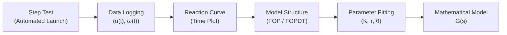
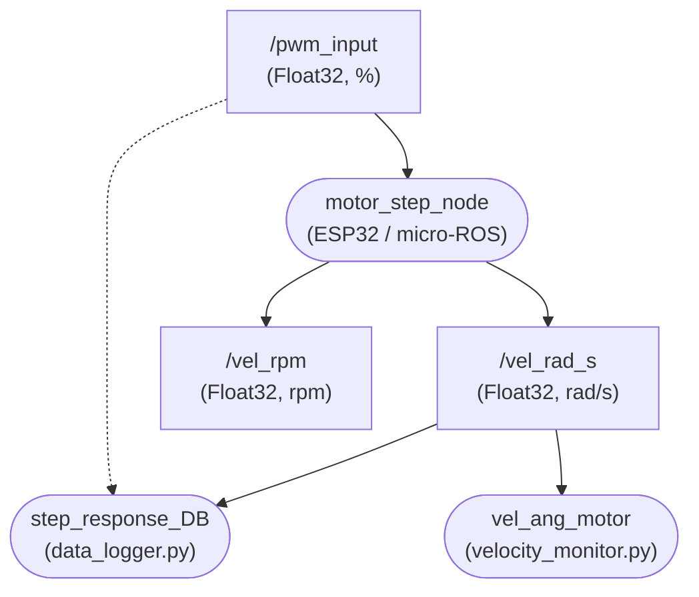

# Guide 2: Experimental Identification via Step Response Testing

<div align="center">

**Course:** Intelligent Control (`ING01343-ING278`)  
**Institution:** Politécnico Colombiano Jaime Isaza Cadavid — Faculty of Engineering  
**Instructor:** Deimer Miranda Montoya, MSc.(c) — `deimer_miranda91162@elpoli.edu.co`  
**Academic Period:** 2026-2  
**Format:** Guided Laboratory (Individual or pairs)  
**Deliverables:** Experimental reaction curves, recorded CSV datasets, and fitted FOP / FOPDT mathematical models

</div>

---

## 1. Introduction

In **Guide 1**, the micro-ROS node `motor_step_node` was built and validated, capable of receiving a PWM command, driving the DC motor, estimating angular velocity from an incremental encoder, and publishing telemetry to ROS 2. The experimental calibration established:

$$\boxed{N_{\mathrm{rev}} = 960\ \text{ticks/rev}}$$

In this second guide, the instrumented setup is used to perform **open-loop experimental parametric identification**. The procedure analyzes the motor's dynamic response to step inputs in PWM through its temporal reaction curve. From the input-output data, two continuous-time transfer function models are fitted and compared:

1. **First-Order Pure Model (FOP — *First Order Plus*):**
   $$G_{\mathrm{FOP}}(s) = \frac{K}{\tau s + 1}$$

2. **First-Order Plus Dead Time Model (FOPDT):**
   $$G_{\mathrm{FOPDT}}(s) = \frac{K e^{-\theta s}}{\tau s + 1}$$

> [!TIP]
> **Methodological Approach:**
> Experimental identification derives a compact, representative mathematical model capturing dominant system dynamics within the operating range, facilitating effective controller synthesis.

---

### 1.1. Learning Outcomes

By the end of this guide, the student will be able to:

1. Perform repeatable and automated step response tests on the DC motor.
2. Simultaneously log PWM input signals and angular velocity to structured CSV files.
3. Interpret the experimental reaction curve of the physical plant.
4. Extract the initial velocity $\omega_0$ and steady-state velocity $\omega_{ss}$.
5. Calculate the static gain $K$ of the system.
6. Estimate the time constant $\tau$ using the $63.2\,\%$ response criterion.
7. Estimate the apparent dead time $\theta$ when observable during the transient.
8. Construct continuous-time FOP and FOPDT transfer function models from real data.
9. Compare fitted parameters across different operating points ($30\,\%$, $45\,\%$, and $60\,\%$ PWM).
10. Assess system linearity versus nonlinearities such as Coulomb friction and deadband.

---

## 2. Starting Point: Validated System

The experiment builds upon the instrumented system with the following topic interfaces:

| Topic | Direction | Message Type | Description |
| :--- | :---: | :---: | :--- |
| `/pwm_input` | PC $\rightarrow$ ESP32 | `std_msgs/msg/Float32` | PWM reference percentage $[-100.0, 100.0]\,\%$ |
| `/vel_rad_s` | ESP32 $\rightarrow$ PC | `std_msgs/msg/Float32` | Angular velocity in $\text{rad/s}$ ($T_s = 0.1\text{ s}$) |
| `/vel_rpm` | ESP32 $\rightarrow$ PC | `std_msgs/msg/Float32` | Angular velocity in $\text{rpm}$ |

$$\omega[k] = \frac{2\pi \Delta N[k]}{960 \Delta t}\quad [\text{rad/s}]$$

> [!CAUTION]
> Before running identification trials, verify that the velocity feedback reacts without spurious delay and that the motor stops completely when sending `0.0` to `/pwm_input`.

---

## 3. Fundamentals: Plant Experimental Identification

Experimental identification models the input-output relationship considering:

* **Input:** $u(t) = \text{Applied PWM } [\%]$
* **Output:** $\omega(t) = \text{Angular Velocity } [\text{rad/s}]$

$$\boxed{G_{\mathrm{exp}}(s) = \frac{\Omega(s)}{U_{\mathrm{PWM}}(s)}}$$



> [!NOTE]
> **Reaction Curve:**
> The temporal trajectory of motor speed in response to an applied step input in PWM. Its geometric profile allows extracting dynamic time constants and static gain.

---

## 4. Model Structures: FOP vs. FOPDT

While a DC motor contains a second-order electromechanical system (armature electrical dynamics $L_a/R_a$ plus mechanical inertia and damping $J/b$), the electrical time constant is orders of magnitude faster than the mechanical time constant. Consequently, speed dynamics are accurately captured by first-order models:

* **FOP Model (First-Order Pure):**
  $$\boxed{G_{\mathrm{FOP}}(s) = \frac{K}{\tau s + 1}}$$
  * $K$: Static gain in $\left[\frac{\text{rad/s}}{\%\,\text{PWM}}\right]$.
  * $\tau$: Time constant in $[\text{s}]$.

* **FOPDT Model (First-Order Plus Dead Time):**
  $$\boxed{G_{\mathrm{FOPDT}}(s) = \frac{K e^{-\theta s}}{\tau s + 1}}$$
  * $\theta$: Apparent delay or dead time in $[\text{s}]$.

---

## 5. ROS 2 Architecture for Step Testing



---

## 6. Acquisition and Plotting Scripts

The nodes are provided within the `dc_motor_experiments` package:

### 6.1. CSV Data Logger (`data_logger.py`)
* Location: [`ros2_ws/src/dc_motor_experiments/dc_motor_experiments/data_logger.py`](../../ros2_ws/src/dc_motor_experiments/dc_motor_experiments/data_logger.py)
* Generates files named: `motor_step_response_YYYYMMDD_HHMMSS.csv`

```csv
Time (s),Angular Velocity (rad/s),PWM (%)
0.100,0.000000,0.000
0.200,0.000000,0.000
...
1.100,2.152431,45.000
...
36.100,45.892100,0.000
```

### 6.2. Real-Time Monitor (`velocity_monitor.py`)
* Location: [`ros2_ws/src/dc_motor_experiments/dc_motor_experiments/velocity_monitor.py`](../../ros2_ws/src/dc_motor_experiments/dc_motor_experiments/velocity_monitor.py)
* Displays dynamic $\omega(t)$ vs $t$ Matplotlib plots at $10\text{ Hz}$.

---

## 7. Experimental Test Matrix

Three independent step trials will be conducted across distinct operating levels:

| Trial | $u_0$ ($\%$) | $u_{\text{step}}$ ($\%$) | Total Duration | Samples ($10\text{ Hz}$) |
| :---: | :---: | :---: | :---: | :---: |
| **1** | $0\,\%$ | $30\,\%$ | $40.0\text{ s}$ | $400$ samples |
| **2** | $0\,\%$ | $45\,\%$ | $40.0\text{ s}$ | $400$ samples |
| **3** | $0\,\%$ | $60\,\%$ | $40.0\text{ s}$ | $400$ samples |

---

## 8. Test Automation via ROS 2 Launch File

To ensure identical, repeatable timing across all experimental runs, the dedicated launch file is used:

* Launch file location: [`ros2_ws/src/dc_motor_bringup/launch/stage_02_identification.launch.py`](../../ros2_ws/src/dc_motor_bringup/launch/stage_02_identification.launch.py)

### Step Profile Timing:

```text
  PWM (%)
     ^
     |              +-----------------------------------+
step |              |                                   |
     |              |           Step (35.0 s)           |
     |              |                                   |
  0% +--------------+                                   +---------------> Time (s)
     0             1.0                                 36.0           40.0
        (Rest 1s)                                        (Rest end 4s)
```

1. **Initial Rest ($0.0\text{ s} - 1.0\text{ s}$):** $0\,\%$ PWM to record baseline initial condition $\omega_0$.
2. **Active Step ($1.0\text{ s} - 36.0\text{ s}$):** Apply $u_{\text{step}}\,\%$ for $35.0\text{ s}$ to reach steady-state.
3. **Final Rest ($36.0\text{ s} - 40.0\text{ s}$):** Return to $0\,\%$ for safe motor deceleration.

### Running the Trials:

```bash
# Build and source the workspace
cd ~/ros2-for-control-dc-motor-system/ros2_ws
colcon build --symlink-install
source install/setup.bash

# Trial 1: 30% PWM Step
ros2 launch dc_motor_bringup stage_02_identification.launch.py step:=30.0

# Trial 2: 45% PWM Step
ros2 launch dc_motor_bringup stage_02_identification.launch.py step:=45.0

# Trial 3: 60% PWM Step
ros2 launch dc_motor_bringup stage_02_identification.launch.py step:=60.0
```

---

## 9. Reaction Curve Analysis

From the recorded CSV dataset, the following key points are identified:

* $t_0$: Exact time of step application ($1.0\text{ s}$).
* $u_0, u_{ss}$: PWM amplitude before and during the step.
* $\omega_0$: Mean initial velocity prior to $t_0$ ($\approx 0\text{ rad/s}$).
* $\omega_{ss}$: Mean steady-state velocity during the plateau.

---

## 10. Static Gain Estimation ($K$)

$$\boxed{K = \frac{\Delta\omega}{\Delta u} = \frac{\omega_{ss} - \omega_0}{u_{ss} - u_0}\quad \left[\frac{\text{rad/s}}{\%\,\text{PWM}}\right]}$$

Starting from rest ($u_0 = 0$, $\omega_0 \approx 0$):

$$K \approx \frac{\omega_{ss}}{u_{ss}}$$

---

## 11. FOP Model: Time Constant Estimation ($\tau$)

The analytic step response of a FOP system is:

$$\omega(t) = \omega_0 + \Delta\omega \left(1 - e^{-(t - t_0)/\tau}\right), \qquad t \geq t_0$$

At $t - t_0 = \tau$:

$$1 - e^{-1} = 1 - 0.367879 = 0.63212 \approx 63.2\,\%$$

$$\boxed{\omega_{63.2} = \omega_0 + 0.632\,(\omega_{ss} - \omega_0)}$$

Locate $t_{63.2}$ where $\omega(t_{63.2}) \approx \omega_{63.2}$:

$$\boxed{\tau_{\mathrm{FOP}} = t_{63.2} - t_0}$$

```text
  ω(t) ^
       |                                              ...  ω_ss
       |                                  . ''''''''''
       |                          . '
ω_63.2 |-------------+---------.'
       |             |       . '
       |             |   . '
   ω_0 +-------------+.'
       0            t_0       t_63.2                         ---> Time (s)
                     |<-- τ -->|
```

---

## 12. FOPDT Model: Apparent Delay Estimation ($\theta$)

If an apparent delay $\theta$ is observed between $t_0$ and the inflection time $t_{\text{start}}$:

$$\boxed{\theta \approx t_{\text{start}} - t_0}$$

$$t_{63.2} = t_0 + \theta + \tau$$

$$\boxed{\tau_{\mathrm{FOPDT}} = t_{63.2} - t_0 - \theta}$$

```text
  ω(t) ^
       |                                              ...  ω_ss
       |                                  . ''''''''''
       |                          . '
ω_63.2 |-----------------------.'
       |                     . '
       |                 . '
   ω_0 +-------------+---+.'
       0            t_0 t_ini t_63.2                         ---> Time (s)
                     | θ |<-- τ -->|
```

---

## 13. Offline Model Fitting Scripts

Automated identification scripts are located in:

* **FOP Model Fitting:** [`stage_02_system_identification/analysis/identify_fop.py`](../../stage_02_system_identification/analysis/identify_fop.py)
* **FOPDT Model Fitting:** [`stage_02_system_identification/analysis/identify_fopdt.py`](../../stage_02_system_identification/analysis/identify_fopdt.py)
* **Operating Point Comparator:** [`stage_02_system_identification/analysis/compare_operating_points.py`](../../stage_02_system_identification/analysis/compare_operating_points.py)

### Running Offline Analysis:

```bash
cd ~/ros2-for-control-dc-motor-system/stage_02_system_identification/analysis

# Identify FOP model for 45% PWM dataset
python3 identify_fop.py ../data/raw/pwm_45/motor_step_response.csv

# Identify FOPDT model for 45% PWM dataset
python3 identify_fopdt.py ../data/raw/pwm_45/motor_step_response.csv

# Compare 30%, 45%, and 60% operating points
python3 compare_operating_points.py ../data/raw/pwm_30/*.csv ../data/raw/pwm_45/*.csv ../data/raw/pwm_60/*.csv
```

---

## 14. Experimental Results Table

Fill the table with parameters extracted from the three trials:

| PWM (\%) | $\omega_{ss}$ (rad/s) | $K$ (rad/s / \%PWM) | $\tau_{\text{FOP}}$ (s) | $\theta$ (s) | $\tau_{\text{FOPDT}}$ (s) | Selected Model |
| :---: | :---: | :---: | :---: | :---: | :---: | :---: |
| **30 %** | | | | | | |
| **45 %** | | | | | | |
| **60 %** | | | | | | |

---

## 15. Continuous Transfer Function Formulations

Formulate the transfer functions identified for each operating point:

$$G_{30}(s) = \frac{K_{30}}{\tau_{30} s + 1}$$

$$G_{45}(s) = \frac{K_{45} e^{-\theta_{45} s}}{\tau_{45} s + 1}$$

$$G_{60}(s) = \frac{K_{60}}{\tau_{60} s + 1}$$

---

## 16. Analysis Questions

1. Why is the experimental transfer function formulated in terms of PWM percentage ($\Omega(s)/U_{\text{PWM}}(s)$) rather than analog armature voltage?
2. What is the physical interpretation and engineering unit of the static gain $K$?
3. Why is the $63.2\,\%$ point an exact mathematical property of linear first-order systems?
4. How does the inclusion of an apparent dead time $\theta$ modify the estimated value of $\tau$?
5. What constraint does a $10\text{ Hz}$ sampling rate ($T_s = 0.1\text{ s}$) impose on the resolution of $\theta$?
6. If the static gain $K$ varies across $30\,\%$, $45\,\%$, and $60\,\%$, what does this indicate regarding plant linearity and Coulomb friction?
7. Why is a simplified first-order model sufficient for designing robust feedback speed controllers for DC motors?

---

## 17. Completion Criteria and Deliverables

$$\boxed{\text{Step Trials (30\%, 45\%, 60\%)} \longrightarrow \text{CSV Datasets} \longrightarrow \text{Parameters } (K, \tau, \theta) \longrightarrow \text{Transfer Functions } G(s)}$$

Completing Guide 2 provides the empirical database, fitted reaction curves, and validated transfer functions necessary for **Guide 3 (Model Validation)** and **Feedback Controller Design (Guides 4 and 5)**.
