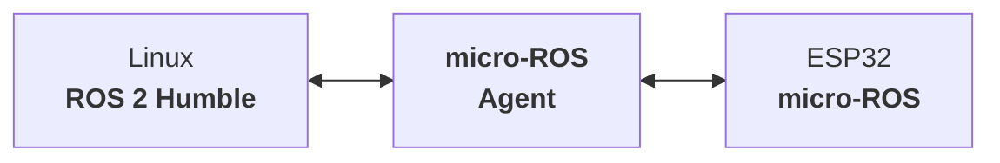
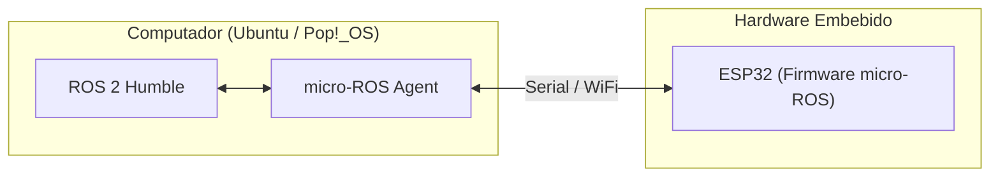

# Guía de Instalación: Linux, ROS 2 Humble y micro-ROS

**Curso:** Robótica del Servicio (`ING 01335`)  
**Facultad:** Facultad de Ingeniería  
**Institución:** Politécnico Colombiano Jaime Isaza Cadavid  
**Docente:** Deimer Miranda Montoya, MSc.(c). (`deimer_miranda91162@elpoli.edu.co`)  
**Periodo Académico:** 2026-2  

---

| **Tiempo Estimado** | **Modalidad** | **Resultado Esperado** |
| :---: | :---: | :---: |
| 2 a 4 horas (según velocidad de descarga e instalación) | Trabajo autónomo guiado e individual | Equipo con Linux 22.04, ROS 2 Humble y micro-ROS correctamente configurados |

---

## 1. Propósito de la guía

Esta guía tiene como propósito preparar el entorno computacional que será utilizado durante el curso de **Robótica del Servicio**.

El entorno estará compuesto principalmente por:

* Pop!_OS 22.04 LTS o Ubuntu 22.04 LTS;
* ROS 2 Humble;
* Herramientas de desarrollo para ROS 2;
* Python 3;
* Git;
* colcon;
* rosdep;
* micro-ROS;
* micro-ROS Agent.

> [!NOTE]
> **Idea Clave:**  
> La finalidad de esta guía no es simplemente copiar y ejecutar comandos. En cada etapa se explicará qué se está instalando, por qué es necesario, qué resultado debería obtenerse y cómo comprobar que la instalación funciona correctamente.

---

## 2. Arquitectura del entorno de desarrollo

Durante el curso se utilizará una arquitectura distribuida en la que el computador ejecutará ROS 2 y posteriormente se comunicará con un microcontrolador ESP32 mediante micro-ROS.



El computador será utilizado para tareas como:

* Programación;
* Visualización;
* Análisis de datos;
* Ejecución de nodos ROS 2;
* Supervisión del robot;
* Comunicación con el sistema embebido.

Posteriormente, el ESP32 permitirá ejecutar tareas de bajo nivel como adquisición de sensores, lectura de encoders y control de actuadores (ubicado en [`firmware/esp32_motor_step/`](../../firmware/esp32_motor_step)).

---

## 3. Requisitos previos

Antes de comenzar se recomienda disponer de:

* Computador de arquitectura x86-64;
* Conexión estable a Internet;
* Memoria USB de al menos 8 GB;
* Copia de seguridad de la información importante;
* Acceso administrativo al computador;
* Al menos 40 GB de espacio disponible en disco.

Para la creación de la memoria USB mediante Rufus será necesario disponer temporalmente de un computador con Windows.

> [!CAUTION]
> **Advertencia sobre particiones:**  
> La instalación de un sistema operativo puede modificar o eliminar particiones del disco. Antes de continuar, realice una copia de seguridad de toda la información importante almacenada en el computador.

---

## 4. Parte I: Instalación de Linux

### 4.1. Sistema operativo recomendado

Para el curso se recomienda utilizar:

**Pop!_OS 22.04 LTS**

Como alternativa puede utilizarse:

**Ubuntu 22.04 LTS**

> [!NOTE]
> Pop!_OS 22.04 está basado en Ubuntu 22.04 y ofrece un entorno de escritorio adecuado para programación, ingeniería y robótica. Ubuntu 22.04 también puede utilizarse directamente durante el curso.

---

### 4.2. Descarga de Pop!_OS 22.04

Pop!_OS proporciona imágenes diferentes dependiendo del hardware gráfico del computador.

#### Versión Intel/AMD
Utilice esta imagen si el computador posee:
* Gráficos integrados Intel;
* Gráficos integrados AMD;
* Tarjeta gráfica AMD;
* O no posee una tarjeta NVIDIA dedicada.

* **Descarga directa:** [pop-os_22.04_amd64_intel_58.iso](https://iso.pop-os.org/22.04/amd64/intel/58/pop-os_22.04_amd64_intel_58.iso)
* **Valor MD5:** `c3d65fc6f9b945ea1f56713749caa173`

#### Versión NVIDIA
Utilice esta imagen si el computador posee una tarjeta gráfica **NVIDIA dedicada**.

* **Descarga directa:** [pop-os_22.04_amd64_nvidia_58.iso](https://iso.pop-os.org/22.04/amd64/nvidia/58/pop-os_22.04_amd64_nvidia_58.iso)
* **Valor MD5:** `5e6d1f058a0a8c137a3c659f9f9675b1`

> [!WARNING]
> **Seleccione correctamente la imagen:**  
> Si su computador utiliza gráficos Intel o AMD, utilice la versión **Intel/AMD**. Si posee una tarjeta NVIDIA dedicada, utilice la versión **NVIDIA**.

---

### 4.3. Alternativa: Ubuntu 22.04

Ubuntu 22.04 LTS puede descargarse desde: [https://releases.ubuntu.com/jammy/](https://releases.ubuntu.com/jammy/)  
Seleccione la opción: **64-bit PC (AMD64) desktop image**.

---

### 4.4. Verificar la imagen descargada

Antes de crear la memoria USB se recomienda verificar que el archivo ISO se haya descargado correctamente.

> [!NOTE]
> **¿Qué es un hash?**  
> Un hash es un valor calculado a partir del contenido de un archivo. Si el archivo descargado cambia o se corrompe, el valor obtenido será diferente al suministrado originalmente.

En Windows, abra **PowerShell** en la carpeta donde descargó la imagen.

Para la versión Intel/AMD:
```powershell
Get-FileHash .\pop-os_22.04_amd64_intel_58.iso -Algorithm MD5
```

Para la versión NVIDIA:
```powershell
Get-FileHash .\pop-os_22.04_amd64_nvidia_58.iso -Algorithm MD5
```

Compare el resultado con el MD5 correspondiente.

> [!TIP]
> Si ambos valores coinciden exactamente, la imagen puede utilizarse para crear la memoria USB de instalación. Si no coinciden, elimine el archivo ISO y vuelva a descargarlo.

---

### 4.5. Descarga de Rufus

Rufus permite crear una memoria USB desde la cual puede iniciarse e instalarse un sistema operativo. Descárguelo desde: [https://rufus.ie/es/](https://rufus.ie/es/)

Rufus puede ejecutarse directamente en Windows sin realizar un proceso tradicional de instalación.

---

### 4.6. Creación de la memoria USB

Conecte la memoria USB al computador y abra Rufus.

> [!WARNING]
> Todo el contenido almacenado actualmente en la memoria USB será eliminado.

Realice el siguiente procedimiento:
1. Seleccione la memoria USB en el campo **Dispositivo**.
2. En **Selección de arranque**, seleccione la imagen ISO descargada.
3. Utilice **GPT** como esquema de partición.
4. Utilice **UEFI** como sistema de destino.
5. Mantenga el sistema de archivos sugerido por Rufus.
6. Mantenga el tamaño de clúster predeterminado.
7. Presione **Empezar**.
8. Confirme la eliminación del contenido de la memoria.

Espere hasta que Rufus indique que el procedimiento ha finalizado.

---

### 4.7. Arranque desde la memoria USB

Reinicie el computador dejando conectada la memoria USB. Durante el inicio deberá acceder al menú de arranque (*Boot Menu*).

Dependiendo del fabricante del computador, puede utilizarse alguna de estas teclas: `F2`, `F10`, `F11`, `F12`, `Esc` o `Del`.

Seleccione la memoria USB como dispositivo de inicio.

---

### 4.8. Instalación del sistema operativo

Una vez iniciado Pop!_OS o Ubuntu desde la memoria USB, siga el asistente gráfico de instalación. Durante el procedimiento deberá seleccionar:
* Idioma;
* Distribución del teclado;
* Disco de instalación;
* Nombre de usuario;
* Contraseña;
* Zona horaria.

> [!CAUTION]
> **Equipos con Windows:**  
> Si desea conservar Windows y configurar un sistema de arranque dual (*dual-boot*), no seleccione opciones que eliminen completamente el disco sin haber identificado previamente las particiones existentes.

Al finalizar la instalación, reinicie el computador y retire la memoria USB cuando el instalador lo indique.

---

## 5. Parte II: Preparación inicial de Linux

### 5.1. Abrir la terminal

En Pop!_OS puede abrirse mediante: `Super (Windows) + T`  
En Ubuntu puede abrirse mediante: `Ctrl + Alt + T`

> [!NOTE]
> **Terminal:** La terminal permite interactuar con el sistema operativo mediante comandos. Durante el curso será utilizada para instalar software, compilar programas, ejecutar ROS 2 y diagnosticar el funcionamiento del sistema.

---

### 5.2. Actualizar el sistema

Antes de instalar ROS 2 es recomendable actualizar el sistema operativo:

```bash
sudo apt update
sudo apt upgrade -y
```

**¿Qué está ocurriendo?**  
* `sudo apt update`: Consulta los repositorios configurados y actualiza la lista de paquetes disponibles.
* `sudo apt upgrade -y`: Instala las versiones más recientes de los paquetes del sistema.

---

### 5.3. Instalar herramientas básicas

Instale las herramientas fundamentales de desarrollo:

```bash
sudo apt install -y git curl wget build-essential python3-pip
```

* `git`: Gestión y clonación de repositorios de código.
* `curl` y `wget`: Descarga de recursos y llaves criptográficas desde Internet.
* `build-essential`: Compiladores GCC/G++ y herramientas de construcción C/C++.
* `python3-pip`: Gestor de paquetes para Python 3.

Verifique la instalación:
```bash
git --version
python3 --version
pip3 --version
```

---

## 6. Parte III: Instalación de ROS 2 Humble

### 6.1. Verificar la versión del sistema

Verifique que el sistema esté basado en Ubuntu 22.04:

```bash
lsb_release -a
```

La salida debe mostrar `Release: 22.04` / `Codename: jammy`.

---

### 6.2. Configurar la codificación UTF-8

ROS 2 requiere configuración regional compatible con UTF-8:

```bash
sudo apt update
sudo apt install -y locales
sudo locale-gen en_US en_US.UTF-8
sudo update-locale LC_ALL=en_US.UTF-8 LANG=en_US.UTF-8
export LANG=en_US.UTF-8
```

Verifique ejecutando `locale`. Debe mostrar `LANG=en_US.UTF-8`.

---

### 6.3. Habilitar el repositorio Universe

```bash
sudo apt install -y software-properties-common
sudo add-apt-repository universe
sudo apt update
```

---

### 6.4. Agregar el repositorio oficial de ROS 2

Descargue la llave GPG de autenticación de paquetes:

```bash
sudo curl -sSL https://raw.githubusercontent.com/ros/rosdistro/master/ros.key -o /usr/share/keyrings/ros-archive-keyring.gpg
```

Agregue el repositorio de ROS 2 a las fuentes de APT:

```bash
echo "deb [arch=$(dpkg --print-architecture) signed-by=/usr/share/keyrings/ros-archive-keyring.gpg] http://packages.ros.org/ros2/ubuntu $(. /etc/os-release && echo $UBUNTU_CODENAME) main" | sudo tee /etc/apt/sources.list.d/ros2.list > /dev/null
```

Actualice el índice de paquetes:

```bash
sudo apt update
```

---

### 6.5. Actualizar el sistema e instalar ROS 2 Humble Desktop

```bash
sudo apt upgrade -y
sudo apt install -y ros-humble-desktop
```

Esta instalación incluye las herramientas principales de ROS 2, bibliotecas de comunicación (rclcpp, rclpy), demos y la herramienta de visualización **RViz2**.

---

### 6.6. Instalar herramientas de desarrollo y colcon

```bash
sudo apt install -y ros-dev-tools python3-colcon-common-extensions
```

> [!NOTE]
> `colcon` es la herramienta estándar utilizada para compilar workspaces y paquetes de ROS 2.

---

### 6.7. Cargar el entorno de ROS 2

Para cargar el entorno en la sesión actual:

```bash
source /opt/ros/humble/setup.bash
```

Verifique la variable de entorno:
```bash
echo $ROS_DISTRO
# Debe retornar: humble
```

Para cargar ROS 2 automáticamente en cada nueva terminal:

```bash
echo "source /opt/ros/humble/setup.bash" >> ~/.bashrc
source ~/.bashrc
```

---

## 7. Parte IV: Verificación de ROS 2

### 7.1. Prueba Publisher – Subscriber

Abra una terminal y ejecute el nodo publicador en C++:

```bash
ros2 run demo_nodes_cpp talker
```

En una segunda terminal, ejecute el nodo suscriptor en Python:

```bash
ros2 run demo_nodes_py listener
```

> [!TIP]
> Si el nodo `talker` publica `Hello World: X` y `listener` los recibe en pantalla, la comunicación DDS básica de ROS 2 está funcionando correctamente. Presione `Ctrl + C` para finalizar.

---

### 7.2. Simulación interactiva con Turtlesim

Instale el simulador pedagógico:

```bash
sudo apt install -y ros-humble-turtlesim
```

Ejecute la ventana de simulación gráfica:

```bash
ros2 run turtlesim turtlesim_node
```

En otra terminal, ejecute el nodo de teleoperación por teclado:

```bash
ros2 run turtlesim turtle_teleop_key
```

En una tercera terminal, inspeccione los nodos y tópicos activos:

```bash
ros2 node list
# Salida esperada: /teleop_turtle, /turtlesim

ros2 topic list
# Salida esperada: /turtle1/cmd_vel, /turtle1/pose, etc.

ros2 topic echo /turtle1/pose
```

---

## 8. Parte V: Configuración de rosdep

`rosdep` permite resolver e instalar automáticamente las dependencias del sistema requeridas por paquetes de ROS:

```bash
sudo rosdep init
rosdep update
```

> [!NOTE]
> Si `sudo rosdep init` indica que el archivo ya existe, ejecute únicamente `rosdep update`.

---

## 9. Parte VI: Instalación y Configuración de micro-ROS

### 9.1. Arquitectura micro-ROS



> [!NOTE]
> El **micro-ROS Agent** actúa como puente intermediario entre el grafo computacional de ROS 2 en el PC y los nodos ligeros ejecutados en microcontroladores (como el firmware del ESP32 ubicado en [`firmware/esp32_motor_step/`](../../firmware/esp32_motor_step)).

---

### 9.2. Creación y Compilación del Workspace de micro-ROS

Cree el espacio de trabajo:

```bash
cd ~
mkdir -p microros_ws/src
cd microros_ws
git clone -b humble https://github.com/micro-ROS/micro_ros_setup.git src/micro_ros_setup
```

Instale las dependencias y compile:

```bash
sudo apt update
rosdep update
rosdep install --from-paths src --ignore-src -y
colcon build
source install/local_setup.bash
```

---

### 9.3. Creación y Compilación del micro-ROS Agent

Descargue y compile el agente:

```bash
ros2 run micro_ros_setup create_agent_ws.sh
ros2 run micro_ros_setup build_agent.sh
source install/local_setup.bash
```

Verifique la disponibilidad del comando:

```bash
ros2 run micro_ros_agent micro_ros_agent --help
```

Automatice el sourcing en su `.bashrc`:

```bash
echo "source ~/microros_ws/install/local_setup.bash" >> ~/.bashrc
source ~/.bashrc
```

---

## 10. Parte VII: Ejecución del micro-ROS Agent

### 10.1. Modo Wi-Fi (UDP)
```bash
ros2 run micro_ros_agent micro_ros_agent udp4 --port 8888
```

### 10.2. Modo Serial (USB - 115200 baudios)
Identifique el puerto USB del microcontrolador conectándolo al PC:
```bash
ls /dev/ttyUSB* # o ls /dev/ttyACM*
```

Ejecute el agente indicando el puerto correspondiente:
```bash
ros2 run micro_ros_agent micro_ros_agent serial --dev /dev/ttyUSB0 -b 115200
```

#### Permisos de Acceso al Puerto Serial:
Si aparece un error de permisos en el puerto, agregue su usuario al grupo `dialout`:
```bash
sudo usermod -a -G dialout $USER
```
*(Es necesario cerrar sesión o reiniciar para aplicar el cambio).*

---

## 11. Parte VIII: Diagnóstico y Solución de Problemas

| Error común | Causa | Solución |
| :--- | :--- | :--- |
| `ros2: command not found` | Entorno no cargado | Ejecutar `source /opt/ros/humble/setup.bash`. |
| `colcon: command not found` | Falta paquete de colcon | Ejecutar `sudo apt install -y python3-colcon-common-extensions`. |
| No aparece `/dev/ttyUSB0` | Asignación en `/dev/ttyACM0` o driver CH340/CP2102 | Ejecutar `ls /dev/ttyACM*` o `lsusb` para revisar conexión física. |
| Permiso denegado en puerto serial | Usuario fuera de `dialout` | Ejecutar `sudo usermod -a -G dialout $USER` y reiniciar sesión. |
| Workspace no reconoce nodos | Falta sourcing local | Ejecutar `source ~/microros_ws/install/local_setup.bash`. |

Para un diagnóstico completo del sistema ROS 2:
```bash
ros2 doctor --report
```

---

## 12. Lista de Verificación Final

- [x] Linux 22.04 inicia correctamente.
- [x] El sistema operativo se encuentra actualizado.
- [x] Git y Python 3 instalados y operativos.
- [x] ROS 2 Humble instalado (`echo $ROS_DISTRO` reporta `humble`).
- [x] Ejemplo `talker` / `listener` funciona.
- [x] Simulador `turtlesim` teleoperable por teclado.
- [x] Comandos `ros2 node list` y `ros2 topic list` funcionales.
- [x] Herramientas `colcon` y `rosdep` instaladas.
- [x] Workspace `~/microros_ws` compilado con éxito.
- [x] `micro_ros_agent` ejecutable por Serial y UDP.
- [x] Puerto serial del ESP32 reconocido por Linux.

---

## 13. Relación con el Repositorio de Control de Motor DC

El entorno configurado en esta guía es la base computacional sobre la cual se ejecutan los paquetes de este repositorio:
* **Firmware del ESP32:** [`firmware/esp32_motor_step/`](../../firmware/esp32_motor_step/) (adquisición de encoder a 10 Hz, PWM por puente H y nodo micro-ROS).
* **Workspace ROS 2:** [`ros2_ws/`](../../ros2_ws/) (paquetes `dc_motor_bringup`, `dc_motor_experiments` y `dc_motor_control`).
* **Etapas experimentales:** [`stage_00_system_design/`](../../stage_00_system_design/) a [`stage_05_closed_loop_control/`](../../stage_05_closed_loop_control/).
