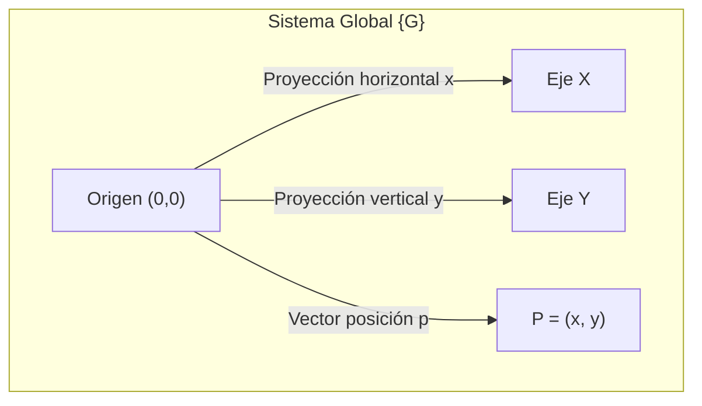
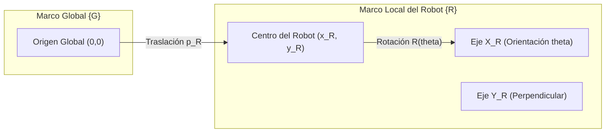

# Guía 2: Rotaciones y Transformaciones en el Plano

**Curso:** Robótica del Servicio (`ING 01335`)  
**Facultad:** Facultad de Ingeniería  
**Institución:** Politécnico Colombiano Jaime Isaza Cadavid  
**Docente:** Deimer Miranda Montoya, MSc.(c). (`deimer_miranda91162@elpoli.edu.co`)  
**Periodo Académico:** 2026-2  

---

| **Tiempo Estimado** | **Modalidad** | **Entregables** |
| :---: | :---: | :---: |
| 3 a 4 horas | Trabajo autónomo guiado e individual | Desarrollo matemático, validación con Python y representación gráfica |

---

## 1. Propósito de la guía

Esta guía tiene como propósito fortalecer la comprensión matemática y geométrica de las rotaciones bidimensionales y de las transformaciones entre sistemas de referencia.

Estos conceptos permiten describir cómo cambia la representación de un punto cuando se modifica la orientación del sistema desde el cual se observa.

Al finalizar las actividades propuestas, el estudiante estará en capacidad de:

* Relacionar coordenadas cartesianas y polares;
* Interpretar geométricamente una rotación;
* Construir y utilizar la matriz de rotación bidimensional;
* Comprobar que una rotación conserva la magnitud de un vector;
* Interpretar las propiedades de ortogonalidad e inversa de $R(\theta)$;
* Realizar composiciones de rotaciones;
* Transformar puntos desde el sistema local del robot al sistema global;
* Realizar la transformación inversa desde el sistema global al local;
* Validar los resultados mediante NumPy;
* Visualizar rotaciones y sistemas de referencia mediante Matplotlib.

> [!NOTE]
> **Idea Clave:**  
> La herramienta computacional se utilizará para comprobar y visualizar los resultados. El punto de partida continuará siendo el desarrollo matemático y su interpretación geométrica.

---

## 2. Representaciones de un punto en el plano

### 2.1. Coordenadas cartesianas

En un plano bidimensional, un punto puede representarse mediante el par ordenado $P=(x,y)$ o mediante un vector columna de coordenadas:

$$\mathbf{p} = \begin{bmatrix} x \\ y \end{bmatrix}$$

Las componentes $x$ y $y$ indican las proyecciones ortogonales del punto sobre los ejes del sistema de referencia.



> [!NOTE]
> Las coordenadas de un punto siempre están asociadas a un sistema de referencia específico. El mismo punto físico posee coordenadas diferentes cuando se observa desde otro marco de referencia.

---

### 2.2. Coordenadas polares

El mismo punto físico puede describirse mediante la distancia al origen $\rho$ y su ángulo polar $\alpha$:

$$P = (\rho, \alpha)$$

donde:
* $\rho$: Distancia euclidiana desde el origen hasta el punto ($\rho \ge 0$).
* $\alpha$: Ángulo de orientación respecto al eje positivo $X$.

**Relaciones de transformación de Cartesianas a Polares:**

$$\rho = \sqrt{x^2 + y^2}$$

$$\alpha = \operatorname{atan2}(y, x)$$

**Relaciones de transformación de Polares a Cartesianas:**

$$x = \rho \cos\alpha$$

$$y = \rho \sin\alpha$$

Por tanto:

$$\mathbf{p} = \begin{bmatrix} \rho \cos\alpha \\ \rho \sin\alpha \end{bmatrix}$$

---

### 2.3. Ejemplo 1: Conversión entre representaciones

Considere el punto cartesiano $P = (-4, 3)$.

1. **Magnitud:**
   $$\rho = \sqrt{(-4)^2 + 3^2} = \sqrt{16 + 9} = \sqrt{25} = 5$$

2. **Dirección angular:**
   $$\alpha = \operatorname{atan2}(3, -4) \approx 143.13^\circ \approx 2.498\text{ rad}$$

3. **Representación polar:**
   $$P = (5, 143.13^\circ)$$

**Comprobación inversa:**
$$x = 5 \cos(143.13^\circ) \approx 5 (-0.8) = -4.0$$
$$y = 5 \sin(143.13^\circ) \approx 5 (0.6) = 3.0$$

---

## 3. Rotaciones en el plano bidimensional

Considere un vector $\mathbf{p} = \begin{bmatrix} \rho \cos\alpha \\ \rho \sin\alpha \end{bmatrix}$. Si se rota un ángulo $\theta$ en sentido antihorario respecto al origen:

* La nueva dirección angular es: $\alpha' = \alpha + \theta$
* La magnitud se conserva invariable: $\rho' = \rho$

El nuevo vector rotado $\mathbf{p}'$ se expresa como:

$$\mathbf{p}' = \begin{bmatrix} \rho \cos(\alpha + \theta) \\ \rho \sin(\alpha + \theta) \end{bmatrix}$$

---

## 4. Deducción y construcción de la matriz de rotación $R(\theta)$

Aplicando las identidades trigonométricas de suma de ángulos:

$$\cos(\alpha + \theta) = \cos\alpha \cos\theta - \sin\alpha \sin\theta$$
$$\sin(\alpha + \theta) = \sin\alpha \cos\theta + \cos\alpha \sin\theta$$

Multiplicando por la magnitud $\rho$ y reconociendo que $x = \rho\cos\alpha$ y $y = \rho\sin\alpha$:

$$x' = \rho \cos(\alpha + \theta) = (\rho \cos\alpha)\cos\theta - (\rho \sin\alpha)\sin\theta = x\cos\theta - y\sin\theta$$
$$y' = \rho \sin(\alpha + \theta) = (\rho \cos\alpha)\sin\theta + (\rho \sin\alpha)\cos\theta = x\sin\theta + y\cos\theta$$

En forma matricial compacta:

$$\begin{bmatrix} x' \\ y' \end{bmatrix} = \begin{bmatrix} \cos\theta & -\sin\theta \\ \sin\theta & \cos\theta \end{bmatrix} \begin{bmatrix} x \\ y \end{bmatrix}$$

Se define la **Matriz de Rotación 2D** $R(\theta)$:

$$R(\theta) = \begin{bmatrix} \cos\theta & -\sin\theta \\ \sin\theta & \cos\theta \end{bmatrix}$$

Operación de rotación directa:

$$\mathbf{p}' = R(\theta)\mathbf{p}$$

---

## 5. Ejemplo 2: Rotación de un vector

Dado el vector $\mathbf{p} = \begin{bmatrix} 4 \\ 2 \end{bmatrix}$ y un ángulo de rotación $\theta = 60^\circ$:

$$R(60^\circ) = \begin{bmatrix} \cos 60^\circ & -\sin 60^\circ \\ \sin 60^\circ & \cos 60^\circ \end{bmatrix} = \begin{bmatrix} \frac{1}{2} & -\frac{\sqrt{3}}{2} \\ \frac{\sqrt{3}}{2} & \frac{1}{2} \end{bmatrix}$$

$$\mathbf{p}' = \begin{bmatrix} \frac{1}{2} & -\frac{\sqrt{3}}{2} \\ \frac{\sqrt{3}}{2} & \frac{1}{2} \end{bmatrix} \begin{bmatrix} 4 \\ 2 \end{bmatrix} = \begin{bmatrix} 2 - \sqrt{3} \\ 2\sqrt{3} + 1 \end{bmatrix} \approx \begin{bmatrix} 0.268 \\ 4.464 \end{bmatrix}$$

### Comprobación de la conservación de la norma:
* Magnitud inicial: $\|\mathbf{p}\| = \sqrt{4^2 + 2^2} = \sqrt{20} \approx 4.472$
* Magnitud final: $\|\mathbf{p}'\| = \sqrt{(0.268)^2 + (4.464)^2} \approx \sqrt{0.0718 + 19.927} \approx 4.472$
* Se verifica rigurosamente: $\|\mathbf{p}'\| = \|\mathbf{p}\|$.

---

## 6. Propiedades algebraicas y geométricas de $R(\theta)$

1. **Rotación nula:**
   $$R(0) = \begin{bmatrix} 1 & 0 \\ 0 & 1 \end{bmatrix} = I \implies R(0)\mathbf{p} = \mathbf{p}$$

2. **Rotación inversa y simetría:**
   $$R^{-1}(\theta) = R(-\theta) = \begin{bmatrix} \cos(-\theta) & -\sin(-\theta) \\ \sin(-\theta) & \cos(-\theta) \end{bmatrix} = \begin{bmatrix} \cos\theta & \sin\theta \\ -\sin\theta & \cos\theta \end{bmatrix} = R^T(\theta)$$

3. **Ortogonalidad ($R \in SO(2)$):**
   $$R^T R = R R^T = I \iff R^{-1} = R^T$$

4. **Demostración de invariancia de la norma:**
   $$\|\mathbf{p}'\|^2 = (R\mathbf{p})^T (R\mathbf{p}) = \mathbf{p}^T (R^T R) \mathbf{p} = \mathbf{p}^T I \mathbf{p} = \mathbf{p}^T \mathbf{p} = \|\mathbf{p}\|^2$$

5. **Determinante unitario:**
   $$\det(R) = (\cos\theta)(\cos\theta) - (-\sin\theta)(\sin\theta) = \cos^2\theta + \sin^2\theta = 1$$

---

## 7. Composición de rotaciones sucesivas

Para dos rotaciones sucesivas $\theta_1$ seguida de $\theta_2$:

$$\mathbf{p}_1 = R(\theta_1)\mathbf{p}, \qquad \mathbf{p}_2 = R(\theta_2)\mathbf{p}_1 = R(\theta_2)R(\theta_1)\mathbf{p}$$

Para rotaciones en el plano bidimensional (conmutativas en $SO(2)$):

$$R(\theta_2)R(\theta_1) = R(\theta_1 + \theta_2)$$

### Ejemplo 3:
Si $\theta_1 = 20^\circ$ y $\theta_2 = -35^\circ$, la rotación neta resultante es $\theta_T = 20^\circ - 35^\circ = -15^\circ$, por lo cual $R(-35^\circ)R(20^\circ) = R(-15^\circ)$.

---

## 8. Transformaciones entre Sistemas de Referencia (Marco Global vs Marco Local)

En robótica móvil se definen dos marcos:
* $\{G\}$: Sistema de referencia global inercial fijo.
* $\{R\}$: Sistema de referencia local móvil solidario al robot.

La pose del robot en el plano se describe mediante el vector de estado:

$${}^{G}\mathbf{x}_R = \begin{bmatrix} x_R \\ y_R \\ \theta \end{bmatrix}$$

donde ${}^{G}\mathbf{p}_R = \begin{bmatrix} x_R \\ y_R \end{bmatrix}$ es la posición global del robot y $\theta$ es la orientación del eje local $X_R$ respecto a $X_G$.



---

### 8.1. Transformación Local a Global (Directa)

Si un sensor montado en el robot detecta un objeto en coordenadas locales ${}^{R}\mathbf{p} = \begin{bmatrix} x^p_R \\ y^p_R \end{bmatrix}$, sus coordenadas globales ${}^{G}\mathbf{p}$ se calculan como:

$${}^{G}\mathbf{p} = {}^{G}\mathbf{p}_R + R(\theta) {}^{R}\mathbf{p}$$

---

### 8.2. Ejemplo 4: Objeto detectado en marco local

* Pose del robot: ${}^{G}\mathbf{p}_R = \begin{bmatrix} -1 \\ 2 \end{bmatrix}, \quad \theta = 30^\circ$
* Coordenadas locales del objeto: ${}^{R}\mathbf{p} = \begin{bmatrix} 4 \\ -1 \end{bmatrix}$

**Cálculo:**
1. Rotación del vector local:
   $$R(30^\circ) {}^{R}\mathbf{p} = \begin{bmatrix} \frac{\sqrt{3}}{2} & -\frac{1}{2} \\ \frac{1}{2} & \frac{\sqrt{3}}{2} \end{bmatrix} \begin{bmatrix} 4 \\ -1 \end{bmatrix} = \begin{bmatrix} 2\sqrt{3} + 0.5 \\ 2 - \frac{\sqrt{3}}{2} \end{bmatrix} \approx \begin{bmatrix} 3.964 \\ 1.134 \end{bmatrix}$$

2. Adición de la traslación del robot:
   $${}^{G}\mathbf{p} = \begin{bmatrix} -1 \\ 2 \end{bmatrix} + \begin{bmatrix} 3.964 \\ 1.134 \end{bmatrix} = \begin{bmatrix} 2.964 \\ 3.134 \end{bmatrix}$$

---

### 8.3. Transformación Global a Local (Inversa)

Dadas las coordenadas globales ${}^{G}\mathbf{p}$ de un objetivo y la pose actual del robot:

$${}^{R}\mathbf{p} = R^T(\theta) \left( {}^{G}\mathbf{p} - {}^{G}\mathbf{p}_R \right)$$

---

### 8.4. Ejemplo 5: Transformación Inversa

* Pose del robot: ${}^{G}\mathbf{p}_R = \begin{bmatrix} 2 \\ -1 \end{bmatrix}, \quad \theta = -90^\circ$
* Objetivo global: ${}^{G}\mathbf{p} = \begin{bmatrix} 5 \\ 3 \end{bmatrix}$

**Cálculo:**
1. Vector traslación relativa:
   $${}^{G}\mathbf{p} - {}^{G}\mathbf{p}_R = \begin{bmatrix} 5 \\ 3 \end{bmatrix} - \begin{bmatrix} 2 \\ -1 \end{bmatrix} = \begin{bmatrix} 3 \\ 4 \end{bmatrix}$$

2. Aplicación de la matriz transpuesta $R^T(-90^\circ) = R(90^\circ)$:
   $${}^{R}\mathbf{p} = \begin{bmatrix} 0 & -1 \\ 1 & 0 \end{bmatrix} \begin{bmatrix} 3 \\ 4 \end{bmatrix} = \begin{bmatrix} -4 \\ 3 \end{bmatrix}$$

---

## 9. Validación y Procesamiento en Python con NumPy

> [!NOTE]
> **Ubicación en el Repositorio:**  
> Estos algoritmos de cálculo matricial y cinemático se utilizan en los paquetes de control y modelado del workspace: [`ros2_ws/src/dc_motor_control/`](../../ros2_ws/src/dc_motor_control/) y en los análisis paramétricos de [`stage_02_system_identification/analysis/`](../../stage_02_system_identification/analysis/).

### 9.1. Script de Transformaciones Matriciales 2D

```python
import numpy as np
import matplotlib.pyplot as plt

# 1. Definición del punto original y ángulo de rotación
p = np.array([2.0, -5.0])
theta_deg = 25.0
theta = np.deg2rad(theta_deg)

# 2. Construcción de la matriz de rotación
R = np.array([
    [np.cos(theta), -np.sin(theta)],
    [np.sin(theta),  np.cos(theta)]
])

# 3. Aplicación del producto matricial (@)
p_rotado = R @ p

# 4. Verificación de propiedades
is_orthogonal = np.allclose(R.T @ R, np.eye(2))
det_R = np.linalg.det(R)
norma_original = np.linalg.norm(p)
norma_rotada = np.linalg.norm(p_rotado)

print("Matriz R(25°):\n", R)
print(f"Vector original: {p}, Norma: {norma_original:.4f}")
print(f"Vector rotado:   {p_rotado}, Norma: {norma_rotada:.4f}")
print(f"¿Es ortogonal (R.T @ R == I)?: {is_orthogonal}")
print(f"Determinante det(R): {det_R:.6f}")
```

---

### 9.2. Script de Visualización Gráfica de Rotaciones

```python
plt.figure(figsize=(8, 8))
plt.quiver(0, 0, p[0], p[1], angles="xy", scale_units="xy", scale=1, color="royalblue", label=f"Original $\mathbf{{p}}$ {p}")
plt.quiver(0, 0, p_rotado[0], p_rotado[1], angles="xy", scale_units="xy", scale=1, color="forestgreen", label=f"Rotado $\mathbf{{p}}'$ ({theta_deg}°)")

plt.axhline(0, color="gray", linestyle="--", linewidth=0.8)
plt.axvline(0, color="gray", linestyle="--", linewidth=0.8)
plt.xlim(-7, 7)
plt.ylim(-7, 7)
plt.gca().set_aspect("equal", adjustable="box")
plt.grid(True)
plt.legend(loc="upper right")
plt.title("Transformación por Rotación en $SO(2)$")
plt.show()
```

---

## 10. Banco de Ejercicios Prácticos

### 10.1. Nivel 1: Cartesianas y Polares
Convierta a polares $(\rho, \alpha)$:
1. $P_1 = (6, 2)$
2. $P_2 = (-5, 4)$
3. $P_3 = (-3, -7)$
4. $P_4 = (2, -6)$
5. $P_5 = (0, -8)$
6. $P_6 = (-9, 0)$

Convierta a cartesianas $(x, y)$:
7. $(\rho, \alpha) = (5, 35^\circ)$
8. $(\rho, \alpha) = (7, 140^\circ)$
9. $(\rho, \alpha) = (4, -50^\circ)$
10. $(\rho, \alpha) = (10, 225^\circ)$

---

### 10.2. Nivel 2: Matrices de Rotación
Construya $R(\theta)$, calcule $R^T$, $\det(R)$ y verifique $R^T R = I$:
11. $R(15^\circ)$
12. $R(45^\circ)$
13. $R(135^\circ)$
14. $R(-30^\circ)$
15. $R(-120^\circ)$
16. $R(180^\circ)$

---

### 10.3. Nivel 3: Rotación de Vectores
Calcule $\mathbf{p}' = R(\theta)\mathbf{p}$ y compare normas:
17. $\mathbf{p} = \begin{bmatrix} 5 \\ -1 \end{bmatrix}, \quad \theta = 35^\circ$
18. $\mathbf{p} = \begin{bmatrix} -2 \\ 6 \end{bmatrix}, \quad \theta = 70^\circ$
19. $\mathbf{p} = \begin{bmatrix} -4 \\ -3 \end{bmatrix}, \quad \theta = -40^\circ$
20. $\mathbf{p} = \begin{bmatrix} 1 \\ 7 \end{bmatrix}, \quad \theta = 110^\circ$
21. $\mathbf{p} = \begin{bmatrix} 8 \\ 0 \end{bmatrix}, \quad \theta = -135^\circ$

---

### 10.4. Nivel 4: Composición de Rotaciones
Determine la rotación equivalente y compruebe matricialmente $R(\theta_2)R(\theta_1) = R(\theta_1 + \theta_2)$:
22. $\theta_1 = 15^\circ, \quad \theta_2 = 65^\circ$
23. $\theta_1 = 80^\circ, \quad \theta_2 = -30^\circ$
24. $\theta_1 = -45^\circ, \quad \theta_2 = -25^\circ$
25. $\theta_1 = 120^\circ, \quad \theta_2 = 70^\circ$

---

### 10.5. Nivel 5: Transformación Local a Global
Calcule ${}^{G}\mathbf{p} = {}^{G}\mathbf{p}_R + R(\theta){}^{R}\mathbf{p}$:
26. ${}^{G}\mathbf{p}_R = \begin{bmatrix} 1 \\ 4 \end{bmatrix}, \quad \theta = 45^\circ, \quad {}^{R}\mathbf{p} = \begin{bmatrix} 3 \\ 2 \end{bmatrix}$
27. ${}^{G}\mathbf{p}_R = \begin{bmatrix} -3 \\ 2 \end{bmatrix}, \quad \theta = -30^\circ, \quad {}^{R}\mathbf{p} = \begin{bmatrix} 5 \\ 1 \end{bmatrix}$
28. ${}^{G}\mathbf{p}_R = \begin{bmatrix} 4 \\ -2 \end{bmatrix}, \quad \theta = 120^\circ, \quad {}^{R}\mathbf{p} = \begin{bmatrix} -1 \\ 3 \end{bmatrix}$
29. ${}^{G}\mathbf{p}_R = \begin{bmatrix} -5 \\ -1 \end{bmatrix}, \quad \theta = 75^\circ, \quad {}^{R}\mathbf{p} = \begin{bmatrix} 2 \\ -4 \end{bmatrix}$

---

### 10.6. Nivel 6: Transformación Global a Local (Inversa)
Calcule ${}^{R}\mathbf{p} = R^T(\theta)({}^{G}\mathbf{p} - {}^{G}\mathbf{p}_R)$:
30. ${}^{G}\mathbf{p}_R = \begin{bmatrix} 2 \\ 3 \end{bmatrix}, \quad \theta = 40^\circ, \quad {}^{G}\mathbf{p} = \begin{bmatrix} 7 \\ 6 \end{bmatrix}$
31. ${}^{G}\mathbf{p}_R = \begin{bmatrix} -4 \\ 1 \end{bmatrix}, \quad \theta = -60^\circ, \quad {}^{G}\mathbf{p} = \begin{bmatrix} 0 \\ 5 \end{bmatrix}$
32. ${}^{G}\mathbf{p}_R = \begin{bmatrix} 3 \\ -3 \end{bmatrix}, \quad \theta = 150^\circ, \quad {}^{G}\mathbf{p} = \begin{bmatrix} -2 \\ 2 \end{bmatrix}$

---

## 11. Taller de Aplicación e Integración

### Contexto Experimental
Un robot móvil posee la pose global:

$${}^{G}\mathbf{x}_R = \begin{bmatrix} -2 \\ 3 \\ 55^\circ \end{bmatrix}$$

Los sensores locales detectan tres balizas en:

$${}^{R}\mathbf{p}_1 = \begin{bmatrix} 4 \\ 1 \end{bmatrix}, \qquad {}^{R}\mathbf{p}_2 = \begin{bmatrix} 2 \\ -3 \end{bmatrix}, \qquad {}^{R}\mathbf{p}_3 = \begin{bmatrix} -1 \\ 4 \end{bmatrix}$$

### Actividades:
1. **Desarrollo Analítico:** Construya $R(55^\circ)$ y calcule ${}^{G}\mathbf{p}_1, {}^{G}\mathbf{p}_2, {}^{G}\mathbf{p}_3$.
2. **Transformación Inversa:** A partir de los resultados globales, aplique ${}^{R}\mathbf{p}_i = R^T(55^\circ)({}^{G}\mathbf{p}_i - {}^{G}\mathbf{p}_R)$ y demuestre que el error numérico es $\mathbf{e} \approx \mathbf{0}$.
3. **Simulación en Python:** Implemente un script que reciba la lista de puntos locales y grafique el marco global, la pose del robot (con sus ejes locales $X_R, Y_R$) y las posiciones de las balizas en el plano.
4. **Prueba de Invariancia:** Modifique la orientación del robot a $\theta = 100^\circ$ y verifique que las distancias relativas $\|\mathbf{p}_i\|$ se mantienen constantes.

---

## 12. Conexión con ROS 2 y la Planta de Motor DC

En el marco del sistema de control del motor DC y robótica móvil con ROS 2:
1. **Transformaciones en ROS 2 (`tf2`):** Las transformaciones homogéneas $T = \begin{bmatrix} R & \mathbf{p} \\ \mathbf{0}^T & 1 \end{bmatrix}$ implementadas matemáticamente en esta guía son la base del árbol de transformaciones (`/tf` y `/tf_static`) entre marcos de coordenadas (`odom` $\rightarrow$ `base_footprint` $\rightarrow$ `base_link`).
2. **Odometría del Motor DC:** La integración de pulsos del encoder procesada en [`firmware/esp32_motor_step/src/main.cpp`](../../firmware/esp32_motor_step/src/main.cpp) y enviada a través de tópicos (`/vel_rad_s`, `/vel_rpm`) permite calcular las velocidades de rueda y, mediante la cinemática diferencial, actualizar en tiempo real el vector de estado $[x_R, y_R, \theta]^T$ del robot.
3. **Identificación Paramétrica (Stage 02):** La identificación de las funciones de transferencia en [`stage_02_system_identification/analysis/`](../../stage_02_system_identification/analysis/) proporciona la dinámica de respuesta temporal del actuador, permitiendo un control de orientación $\theta(t)$ y seguimiento de trayectoria preciso en el plano.
