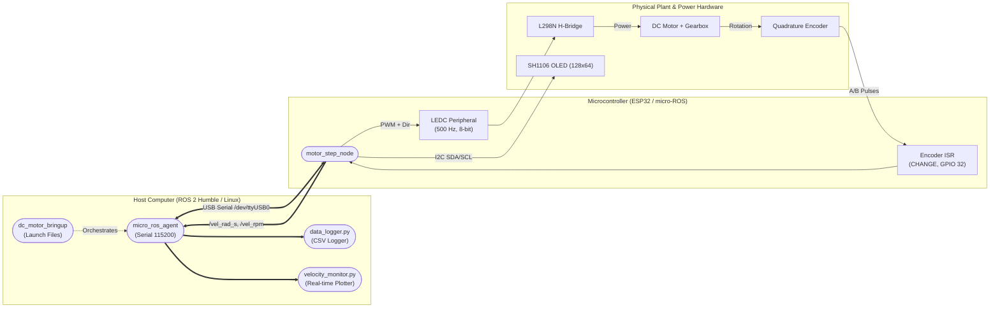

# Stage 00: System Design

<div align="center">


</div>

---

## 🎯 Guiding Question
> **How should the distributed system be architected to actuate the motor and observe its dynamic behavior reliably?**

---

## 📌 Objectives

1. **Distributed System Architecture:** Establish clear boundaries and responsibilities between the host computer (ROS 2 Humble) and the real-time microcontroller (ESP32 / micro-ROS).
2. **Interface Specification:** Formalize the communication contract (topics, datatypes, frequencies, and engineering units).
3. **Hardware & Electrical Pinout:** Define the pin assignments for motor PWM, H-Bridge logic levels, encoder interrupts, and the $I^2C$ telemetry display.
4. **Foundational Readiness:** Lay the groundwork for reproducible step-response experiments and closed-loop control.

---

## 🏗️ System Architecture & Topology



---

## 📐 Topic Contract and Interfaces

| Topic | Direction (rel. to ESP32) | Message Type | Rate | Units / Range | Purpose |
| :--- | :---: | :---: | :---: | :---: | :--- |
| `/pwm_input` | Input | `std_msgs/msg/Float32` | Asynchronous | $[-100.0, 100.0]\,\%$ | Signed PWM command applied to L298N driver |
| `/vel_rad_s` | Output | `std_msgs/msg/Float32` | $10\text{ Hz}$ | $\text{rad/s}$ | Estimated shaft angular velocity |
| `/vel_rpm` | Output | `std_msgs/msg/Float32` | $10\text{ Hz}$ | $\text{rpm}$ | Estimated shaft angular velocity |

---

## 🔌 Hardware Pinout Allocation

| ESP32 Pin | Signal | Hardware Module | Function / Configuration |
| :---: | :---: | :---: | :--- |
| `GPIO 32` | `ENCA` | Encoder Channel A | Hardware interrupt input (`CHANGE`) |
| `GPIO 33` | `ENCB` | Encoder Channel B | Direction sensing logic level |
| `GPIO 25` | `ENB` | L298N H-Bridge | PWM modulation (LEDC Channel 0, 500 Hz, 8-bit) |
| `GPIO 27` | `IN3` | L298N H-Bridge | Direction control logic level |
| `GPIO 26` | `IN4` | L298N H-Bridge | Direction control logic level |
| `GPIO 21` | `SDA` | SH1106 OLED | $I^2C$ Data line |
| `GPIO 22` | `SCL` | SH1106 OLED | $I^2C$ Clock line |

---

## 📁 Directory Organization

```text
stage_00_system_design/
├── README.md                            # Stage 00 presentation and specifications
├── architecture/                        # System block diagrams and interface definitions
│   └── README.md
└── results/                             # System design deliverables and schemas
    └── README.md
```

---

## 📖 Associated Academic Guide

For in-depth mathematical derivations and design rationale, refer to:
* **[Guide 0: Design of a micro-ROS Node for a DC Motor](../docs/guides/Inteligente_guia0.md)**

---

## ⏭️ Next Step

Proceed to **[Stage 01: Motor Instrumentation](../stage_01_motor_instrumentation/README.md)** to calibrate the encoder, flash the micro-ROS firmware, and validate hardware actuation.
